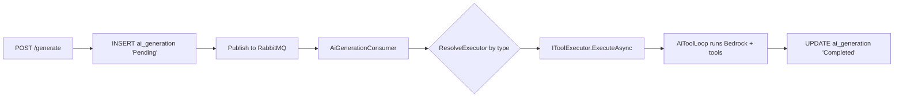

# Architecture

```
src/Chthonic.AI/
├── Bedrock/
│   ├── IAiClient.cs / BedrockAiClient.cs
│   └── BedrockOptions.cs
├── Auth/
│   ├── IAiKeypairProvider.cs / SecretsManagerAiKeypairProvider.cs
│   ├── IAiKeyAuthHelper.cs / AiKeyAuthHelper.cs
│   └── AiKeyAuthMiddleware.cs
├── Logging/
│   ├── IAiSessionLogger.cs / CloudWatchAiSessionLogger.cs
├── ToolLoop/
│   ├── AiToolLoop.cs
│   └── IToolExecutor.cs
├── Generation/
│   ├── AiGeneration.cs (entity)
│   ├── AiGenerationConsumer.cs (BackgroundService)
│   ├── IAiGenerationService.cs
├── Endpoints/AiGenerationsEndpoints.cs
└── ServiceCollectionExtensions.cs
```

## Generation flow



## AiToolLoop

Drives the Bedrock Converse API + tool-call cycle:

```
loop (max 20):
    response = bedrock.Converse(messages, tools)
    if response.stop_reason == 'end_turn': break
    for each tool_call in response:
        result = executor.RunToolAsync(tool_call.name, tool_call.input)
        messages.append(tool_call_result)
```

Cap at 20 iterations prevents infinite loops on misbehaving models.

## ECDSA keypair auth

Each tool's HTTP callback (e.g. `update_profile` calls `PUT /api/systems/my-system/profile`) is signed with an ECDSA private key stored in AWS Secrets Manager. The matching public key is auto-registered as a `claude-ai-api-key` user_public_key on admin user creation. The middleware validates incoming signatures.

## Tests

`AiToolLoopTests` (iteration cap, cancellation), `AiGenerationConsumerTests` (routing), `BedrockAiClientTests` (HTTP mocked), per-executor tests live in consumer libraries.

## Related

- [`bedrock-integration.md`](bedrock-integration.md), [`ai-tool-loop.md`](ai-tool-loop.md), [`tool-executor-pattern.md`](tool-executor-pattern.md).
