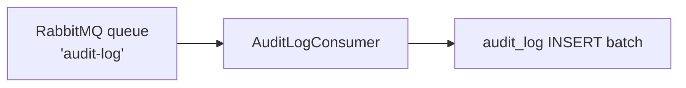

# Architecture

## File layout

```
src/Chthonic.Audit/
├── AuditSaveChangesInterceptor.cs       # EF interceptor; auto-emits on save
├── IRabbitMqConnection.cs               # Port for consumer to register
├── Migrations/                          # ChthonicAudit_0001_Initial
├── Configuration/AuditLogConfiguration.cs
├── Domain/
│   ├── AuditLog.cs                      # the row
│   ├── AuditEntry.cs                    # input DTO for LogAsync
│   ├── AuditCategory.cs                 # enum
│   └── AuditAttributes.cs               # [AuditParent], [AuditCategory], [AuditAction]
├── Services/
│   ├── IAuditLogger.cs / AuditLogger.cs            # primary write API
│   ├── AuditLogConsumer.cs              # BackgroundService consuming RabbitMQ
│   ├── IAuditQueryService.cs / AuditQueryService.cs # read API
│   └── IAuditRetentionService.cs / AuditRetentionService.cs # cleanup
├── AuditModuleMarker.cs
└── ServiceCollectionExtensions.cs
```

## Schema

```sql
CREATE TABLE audit_log (
    audit_log_id BIGINT PRIMARY KEY AUTO_INCREMENT,
    system_id INT NOT NULL,
    user_id INT NULL,
    category VARCHAR(50) NOT NULL,
    action VARCHAR(100) NOT NULL,
    entity_type VARCHAR(100) NOT NULL,
    entity_id INT NULL,
    parent_type VARCHAR(100) NULL,
    parent_id INT NULL,
    changes JSON NULL,
    metadata JSON NULL,
    created_at DATETIME NOT NULL,
    INDEX ix_audit_system_created (system_id, created_at),
    INDEX ix_audit_entity (entity_type, entity_id),
    INDEX ix_audit_parent (parent_type, parent_id),
    INDEX ix_audit_user (user_id)
);
```

## EF interceptor

`AuditSaveChangesInterceptor` walks `ChangeTracker.Entries()` before save:

1. For each `EntityState.Added` / `Modified` / `Deleted` entry:
2. Read `[AuditCategory]` attribute (skip if absent).
3. Read `[AuditParent]` attribute (optional rollup).
4. Build a `Changes` dict from `e.OriginalValues` vs `e.CurrentValues`.
5. Build an `AuditEntry` and enqueue to RabbitMQ.

After save, enqueued entries dispatch.

## `[AuditParent]` attribute

Two constructor variants:

```csharp
[AuditCategory("Work")]
[AuditParent(typeof(Job), nameof(JobId))]              // typed; preferred
public class JobMechanic { ... }

[AuditCategory("Parties")]
[AuditParent("Vehicle", nameof(VehicleId))]            // string; cross-library
public class CustomerVehicle { ... }
```

The string form (added in v0.1.4 per PR 04b) lets parties annotate `CustomerVehicle` with a parent type that lives in `@chthonic/assets` without a hard reference.

## Consumer

`AuditLogConsumer : BackgroundService` runs once per app:



Batches inserts (50 per round-trip) for throughput. Failures are retried with exponential backoff; ultimate failures dead-letter to `audit-log-dlq`.

## Retention

`AuditRetentionService : BackgroundService` runs nightly:

```sql
DELETE FROM audit_log
WHERE created_at < NOW() - INTERVAL ? DAY
LIMIT 10000;   -- batched; loops until done
```

Default retention: 365 days. Configurable via `services.AddChthonicAudit(opts => opts.RetentionDays = 730)`.

## `IRabbitMqConnection` port

```csharp
public interface IRabbitMqConnection
{
    IConnection GetConnection();
}
```

Consumer registers an adapter wrapping `RabbitMQ.Client` (or a mock for tests). The library doesn't manage the connection lifecycle directly so consumers can reuse a process-wide connection across multiple libraries that need RabbitMQ (audit, notifications, AI).

## Tests

| File | Coverage |
|---|---|
| `AuditLoggerTests` | `LogAsync` enqueues; uses `IRabbitMqConnection` |
| `AuditSaveChangesInterceptorTests` | `[AuditParent]` typed + string variants; change diff |
| `AuditLogConsumerTests` | Batch insert; dead-letter on persistent failure |
| `AuditQueryServiceTests` | Read filters by entity / parent / user / date range |
| `AuditRetentionServiceTests` | Cleanup with retention boundary |

## Related

- [`index.md`](index.md), [`consumption.md`](consumption.md), [`extension-points.md`](extension-points.md).
- [`auditparent-attribute.md`](auditparent-attribute.md), [`rabbitmq-pipeline.md`](rabbitmq-pipeline.md), [`cross-library-writes.md`](cross-library-writes.md).
- [RFC 0006](https://github.com/chthonicsystems/architecture/blob/main/rfcs/0006-audit-logging.md).
