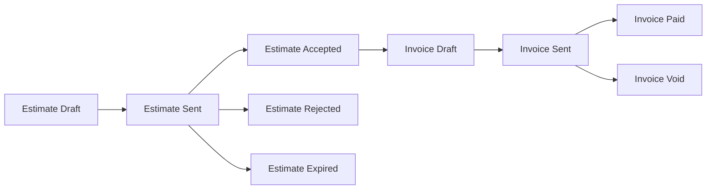

# Estimate → Invoice → Paid

## Estimate

- Created from a Job spec (line items inherited from `Job.ServiceItems`).
- Sent via `@chthonic/notifications` → email + customer-portal banner.
- Customer accepts → status `Accepted` → can convert to Invoice.
- Customer rejects → status `Rejected`; no conversion.
- TTL exceeded → status `Expired`.

## Invoice

- `IInvoiceService.CreateFromEstimateAsync(estimate)` — copies line items + sets `due_date = today + payment_terms.default_payment_days`.
- Sent via notifications.
- Paid via `@chthonic/payments` (admin manually marks paid OR Stripe webhook PaymentSucceededEvent → handler updates).
- Reminders via `ReminderScheduler` (consumer-supplied) at PreDueDay7 / DueDate / OverdueAfterGrace.

## Reminder scheduler

`@chthonic/notifications.ReminderScheduler` (BackgroundService) runs daily. For each invoice `Sent` + `due_date` matches a milestone, fires email reminder. Idempotent via `notification_log(invoice_id, reminder_milestone)` composite index.

## Conversion to remote accounting

When an invoice is `Sent`, the consumer's wired `IAccountingProvider.PushInvoiceAsync` fires (background or sync). The remote ID is stored in `invoice.metadata['xero_invoice_id']` etc. for later push-payment correlation.

## Consumer extension — TT job-scoped extra-work approval (PR 03 / RFC 0026)

TorqueTech composes the existing primitives into a job-scoped composite endpoint that creates an estimate revision mid-job:

- `POST /api/jobs/{id}/approval/request { additionalItems[] }` — TT-owned route that, while a Job is `InProgress`, creates a new revision of the Job's Estimate (`(SequenceNumber, RevisionNumber+1)`) carrying forward existing line items + appending the new ones, sets `Status=Sent`, then calls `IDocumentService.RenderDocumentAsync` and the existing send-to-customer notification path.
- `GET /api/jobs/{id}/approval/status` — read-only companion that returns derived state (`none | pending | approved | declined`) computed from the revision history. No flag column.
- The customer-side approve/reject loop reuses `PUT /api/documents/{id}/approve|reject` unchanged; that endpoint already cascades to `Estimate.Status` and fires `NotifyEstimateApprovedAsync` / `NotifyEstimateRejectedAsync`.

**No public surface in `@chthonic/billing` changes** — the feature is a pure consumer-side composition. Sister products that adopt the same pattern would either replicate the TT-side endpoint or, if the demand is broad, lift it to `@chthonic/work` as a generic `RequestApprovalAsync` on the Job spine.

**No schema delta** — Estimate gets no new columns. Mid-job-ness is purely derived: "exists a prior revision in the same sequence with `Status=Approved`".

## Related

- [`xero-integration.md`](xero-integration.md), [`quickbooks-integration.md`](quickbooks-integration.md).
- [`libraries/payments/`](../payments/) — payment events.
- [`libraries/notifications/reminders.md`](../notifications/reminders.md).
