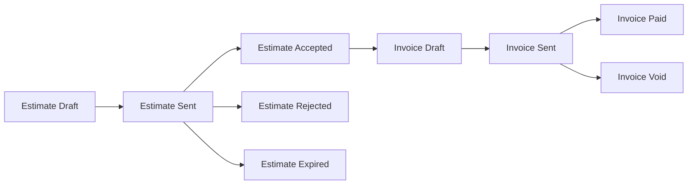

# Estimate → Invoice → Paid



## Estimate

- Created from a Job spec (line items inherited from `Job.ServiceItems`).
- Sent via `@chthonic/notifications` → email + customer-portal banner.
- Customer accepts → status `Accepted` → can convert to Invoice.
- Customer rejects → status `Rejected`; no conversion.
- TTL exceeded → status `Expired`.

## Invoice

- `IInvoiceService.CreateFromEstimateAsync(estimate)` — copies line items + sets `due_date = today + payment_terms.default_payment_days`.
- Sent via notifications.
- Paid via `@chthonic/payments` (admin manually marks paid OR Stripe webhook PaymentSucceededEvent → handler updates).
- Reminders via `ReminderScheduler` (consumer-supplied) at PreDueDay7 / DueDate / OverdueAfterGrace.

## Reminder scheduler

`@chthonic/notifications.ReminderScheduler` (BackgroundService) runs daily. For each invoice `Sent` + `due_date` matches a milestone, fires email reminder. Idempotent via `notification_log(invoice_id, reminder_milestone)` composite index.

## Conversion to remote accounting

When an invoice is `Sent`, the consumer's wired `IAccountingProvider.PushInvoiceAsync` fires (background or sync). The remote ID is stored in `invoice.metadata['xero_invoice_id']` etc. for later push-payment correlation.

## Consumer extension — TT job-scoped extra-work approval (PR 03 / RFC 0026)

TorqueTech composes the existing primitives into a job-scoped chip+button pattern on JobDetail. The pattern is symmetric for Estimate (InProgress jobs) and Invoice (Closed jobs); both ride on existing feature gates with no new feature key, no new permission, no migration.

### Estimate (Job.Status === 'InProgress')

- `POST /api/jobs/{id}/approval/request` — TT-owned route. Empty body. Behaviour matrix derived from the revision history of the Job's linked Estimate sequence:

  ```
  A   Job has no estimate          → create new Estimate (rev 1, fresh sequence)
  B1  Latest revision Status=Draft → return existing Draft id (no new row)
  C1  Latest revision Status=Sent  → create new Draft revision N+1 carrying
                                      forward FieldValues + RequestedServices
  D   Latest revision Approved     → create new Draft revision N+1
  E   Latest revision Rejected     → create new Draft revision N+1
  ```

  Returns `201 { estimateId, revisionNumber }`. The mechanic is then redirected by the frontend to `/estimates/{id}/edit` (the lib's `<EditEstimatePage>`, see below) where they add line items + send-to-customer using the existing UI. **No additional-items modal.**

- `GET /api/jobs/{id}/approval/status` — read-only companion. Returns one of 5 derived states:

  ```
  noEstimate | draft | pending | approved | rejected
  ```

  Plus optional `estimateId`, `revisionNumber`, `sentAt`, `approvedAt`, `rejectedAt`, `rejectedReason`. No flag column, no schema change.

- The customer-side approve/reject loop reuses `PUT /api/documents/{id}/approve|reject` unchanged.

### Invoice (Job.Status === 'Closed')

- `POST /api/jobs/{id}/invoice/request` — TT-owned route mirror. Empty body. Behaviour matrix:

  ```
  no active             → create rev 1 of new sequence (delegates to existing GenerateInvoiceFromJobAsync)
  Draft                 → return existing draft id
  Sent (pending)        → create new Draft revision N+1 carrying forward FieldValues
  Paid                  → return paid id (terminal; UI hides the create button)
  Cancelled-only        → create rev 1 of new sequence
  ```

- `GET /api/jobs/{id}/invoice/status` — 5-state derivation:

  ```
  noInvoice | draft | pending | paid | cancelled
  ```

The endpoints live under `api/Features/Jobs/Invoice/` on disk but the C# namespace is `TorqueTech.Api.Features.Jobs.JobInvoice` — `Invoice` clashes with the `Invoice` Domain entity class.

### Lib changes

- **`@chthonicsystems/billing` v0.3.0** — split `<CreateEstimatePage>` (create-only, reads `?jobId=`) + `<EditEstimatePage>` (edit-only, reads `:id` from `useParams`). `<EstimateDetailPage>` Edit button now navigates to `/estimates/{id}/edit`. The old `?estimateId=` query-param edit support is removed.
- **`@chthonicsystems/billing` v0.4.0** — adds a "Job #N" back-link chip in the hero of both `<EstimateDetailPage>` and `<InvoiceDetailPage>`. Click navigates to `/jobs/{jobId}`. Hidden in customer-portal `viewMode='customer'` rendering. The estimate side requires a `JobId` field on the API's `EstimateDetailResponse` (additive, non-breaking); invoice already carried `jobId`.

Sister products that adopt the same pattern can either replicate the TT-side endpoints or, if the demand is broad, lift them to `@chthonic/work` as generic `RequestApprovalAsync` / `RequestInvoiceAsync` methods on the Job spine.

**No schema delta** — Estimate and Invoice get no new columns. Mid-job-ness is derived from revision history (matrix above).

## Related

- [`xero-integration.md`](xero-integration.md), [`quickbooks-integration.md`](quickbooks-integration.md).
- [`libraries/payments/`](../payments/) — payment events.
- [`libraries/notifications/reminders.md`](../notifications/reminders.md).
