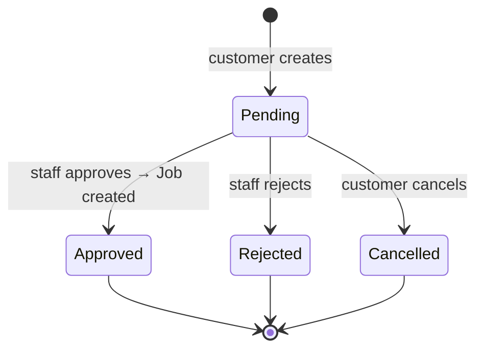

# Architecture

```
src/Chthonic.Booking/
├── Domain/Booking.cs, ServiceTimeSlot.cs, ServiceOffDay.cs
├── Configuration/         # EF configs
├── Services/
│   ├── IBookingService.cs / BookingService.cs
│   └── IBookingAvailabilityService.cs / BookingAvailabilityService.cs
├── Extensions/
│   ├── IBookingNotificationDispatcher.cs   # consumer port
│   ├── IBookingLimitService.cs              # consumer port
│   └── IBookingDbContextProvider.cs         # consumer port
├── Migrations/
└── ServiceCollectionExtensions.cs
```

## State machine



State transitions are validated; consumer can override via custom `IBookingService`.

## Cross-library FK dropping

Per PR 14, `Booking.Estimate` and `Booking.Job` nav properties are **dropped**. Booking has the FKs (`estimate_id`, `job_id`) but no nav. Consumer projections (e.g. `BookingResponse` in TT) re-hydrate via batch lookups. See [`availability-service.md`](availability-service.md) and PR 14c.

## Tests

`BookingAvailabilityServiceTests` (slot math, off-day handling, overbooking prevention), `BookingServiceTests` (state transitions).

## Related

- [`availability-service.md`](availability-service.md), [`time-slots.md`](time-slots.md).
