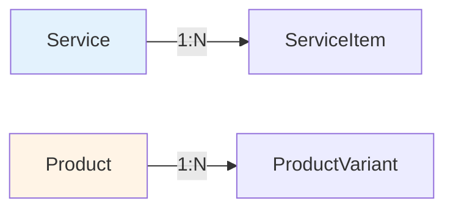

# Architecture

## File layout

```
src/Chthonic.Catalog/
├── Domain/
│   ├── Service.cs
│   ├── ServiceItem.cs
│   ├── Product.cs
│   └── ProductVariant.cs
├── Configuration/CatalogConfigurations.cs   # EF configs
├── Migrations/                              # ChthonicCatalog_0001_Initial
├── Services/
│   ├── ICatalogServices.cs
│   └── CatalogServices.cs
├── Endpoints/CatalogEndpoints.cs            # /api/services/*, /api/products/*
├── Extensions/IDbContextProvider.cs         # consumer port
├── CatalogModuleMarker.cs
└── ServiceCollectionExtensions.cs
```

## Entity relationships



`Service` has many `ServiceItem`s (each with cost). `Product` has many `ProductVariant`s (each with SKU, barcode, price).

## ICatalogServices

```csharp
public interface ICatalogServices
{
    // Services
    Task<List<Service>> ListServicesAsync(int systemId);
    Task<Service?> GetServiceAsync(int serviceId);
    Task<Service> CreateServiceAsync(int systemId, ServiceInput input);
    Task<Service> UpdateServiceAsync(int serviceId, ServiceInput input);
    Task DeleteServiceAsync(int serviceId);

    // Service items
    Task<List<ServiceItem>> ListServiceItemsAsync(int serviceId);
    Task<ServiceItem> AddServiceItemAsync(int serviceId, ServiceItemInput input);
    Task UpdateServiceItemAsync(int serviceItemId, ServiceItemInput input);
    Task DeleteServiceItemAsync(int serviceItemId);

    // Products + variants — same shape as Services + ServiceItems.
}
```

## IDbContextProvider port

```csharp
public interface IDbContextProvider
{
    DbContext GetDbContext();
}
```

Consumer registers an adapter pointing at their app DbContext:

```csharp
public class MyDbContextProvider : IDbContextProvider
{
    private readonly TorqueTechDbContext _db;
    public MyDbContextProvider(TorqueTechDbContext db) => _db = db;
    public DbContext GetDbContext() => _db;
}

builder.Services.AddScoped<IDbContextProvider, MyDbContextProvider>();
```

The library uses this to read/write entities without owning its own DbContext (so each consumer's connection-string + transaction context is preserved).

## Endpoints

```
# Services
GET    /api/services
GET    /api/services/{id}
GET    /api/services/search?q=...
POST   /api/services
PUT    /api/services/{id}
DELETE /api/services/{id}

# Service items
GET    /api/services/{serviceId}/items
POST   /api/services/{serviceId}/items
PUT    /api/services/{serviceId}/items/{id}
DELETE /api/services/{serviceId}/items/{id}

# Products + variants — mirror shape
```

Auth: `action:manage-inventory` (or override via consumer permission options).

## Tests

| File | Coverage |
|---|---|
| `CatalogConfigurationTests` | EF configs map columns + indexes correctly |
| `CatalogBootstrapSmokeTests` | Service registration + DI smoke test |
| (Service/Product CRUD service tests are added per consumer; library ships smoke + config tests) |

## Related

- [`index.md`](index.md), [`consumption.md`](consumption.md), [`extension-points.md`](extension-points.md).
- [`service-and-product.md`](service-and-product.md), [`serviceitem-fields.md`](serviceitem-fields.md), [`productvariant-pricing.md`](productvariant-pricing.md).
- [RFC 0021](https://github.com/chthonicsystems/architecture/blob/main/rfcs/0021-catalog.md).
