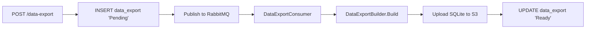

# Architecture

```
src/Chthonic.Data/
├── Domain/DataExport.cs
├── Configuration/, Migrations/
├── Services/
│   ├── IDataExportService.cs / DataExportService.cs
│   ├── DataExportBuilder.cs
│   ├── DataExportLimitService.cs
│   ├── ArtifactCollector.cs
│   └── DataExportConsumer.cs (BackgroundService)
├── Endpoints/
├── Templates/ExportReadme.html
└── ServiceCollectionExtensions.cs
```

## Pipeline



## SQLite shape

One DB file per export. Tables: `system`, `users`, `customer`, `asset`, `job`, `booking`, `estimate`, `invoice`, plus their children. Bare schema (no FK constraints in the export — readers can join by ID).

Embedded resource `Templates/ExportReadme.html` is added as a row in a `_meta` table; explains the export's contents and how to import to another product.

## Tests

`DataExportBuilderTests` (schema integrity), `DataExportLimitServiceTests` (per-tier caps), `DataExportConsumerTests` (state transitions).

## Related

- [`sqlite-export.md`](sqlite-export.md), [`per-tenant-bundling.md`](per-tenant-bundling.md).
