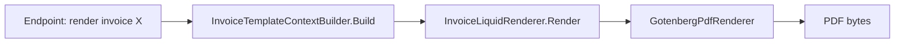

# Architecture

```
src/Chthonic.Documents/
├── Common/
│   ├── TypeTemplateContext.cs
│   ├── TypeLiquidRenderer.cs
│   ├── TypeTemplateRegistry.cs
│   ├── TypeTemplateContextBuilder.cs
│   └── GotenbergPdfRenderer.cs
├── JobCardTemplate*/      # per-type concrete classes
├── InvoiceTemplate*/
├── EstimateTemplate*/
├── ServiceHistoryTemplate*/
├── Templates/             # 4 themes × 4 doc types = 16 base templates (Liquid + CSS)
├── AiTemplate/            # per-type AI tool executors + system prompts
├── Endpoints/
└── ServiceCollectionExtensions.cs
```

## Pipeline



`{Type}TemplateContext` carries the typed data. `{Type}LiquidRenderer` runs Liquid against it. `GotenbergPdfRenderer` POSTs the rendered HTML to Gotenberg. PDF returned.

## Tests

Per-type context-builder tests (real + sample data). Renderer smoke tests (Liquid compiles). Library-level Gotenberg integration test mocks the sidecar.

## Related

- [`liquid-pipeline.md`](liquid-pipeline.md), [`gotenberg-pdf.md`](gotenberg-pdf.md), [`four-themes.md`](four-themes.md).
