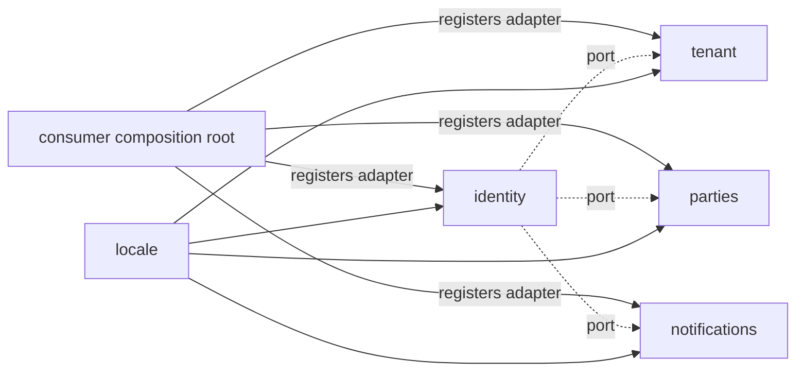

# Extension points

Identity exposes **five ports** as `interface` types in `Ports/`. Consumers MUST register an adapter for each before `AddChthonicIdentity`; the library validates registration at startup and fails fast with a helpful message.

| Port | Bridge to | Lifetime |
|---|---|---|
| `IJwtIssuerOptions` | Per-product issuer / audience / signing key / expiry | Singleton |
| `ISystemFeatureSnapshot` | `@chthonic/tenant` feature-flag tables | Scoped |
| `ITierResolver` | `@chthonic/tenant` subscription tier | Scoped |
| `ICustomerLinkingPort` | `@chthonic/parties` customer-user linking | Scoped |
| `INotificationPort` | `@chthonic/notifications` email + SMS | Scoped |

## Why ports

Identity must NOT depend on tenant or notifications at compile time — that would create a near-cycle (tenant depends on identity, identity needs tenant features at login). The port pattern moves the dependency to the consumer's composition root.



## Per-port adapter shape

### `IJwtIssuerOptions`

```csharp
public interface IJwtIssuerOptions
{
    string Issuer { get; }
    string Audience { get; }
    string SigningKey { get; }   // base64; >= 256 bits
    TimeSpan Expiry { get; }
}
```

Read once per JWT issuance. Consumer typically reads from environment / appsettings.

### `ISystemFeatureSnapshot`

```csharp
public interface ISystemFeatureSnapshot
{
    Task<Dictionary<string, bool>> GetEnabledFeaturesAsync(int systemId);
}
```

Called by `AuthHelper.CreateLoginResponse(...)` to populate the login response with the tenant's enabled feature flags. Consumer adapter delegates to `@chthonic/tenant`'s `IFeatureGateService.GetSnapshotAsync(systemId)`.

### `ITierResolver`

```csharp
public interface ITierResolver
{
    Task<string> GetTierAsync(int systemId);  // "Free" | "Standard" | "Premium"
}
```

Same call site as `ISystemFeatureSnapshot`. Returns the tenant's current subscription tier as a string.

### `ICustomerLinkingPort`

```csharp
public interface ICustomerLinkingPort
{
    Task<int?> LinkUserToCustomerAsync(int userId, string mobile, int systemId);
}
```

Called when a customer registers via `/api/customer-auth/register` — links the new user to an existing `customer` row matched by mobile (or returns null if no match).

### `INotificationPort`

```csharp
public interface INotificationPort
{
    Task SendInviteEmailAsync(string email, string inviteUrl);
    Task SendVerificationCodeAsync(string mobile, string code);
    Task SendPasswordResetEmailAsync(string email, string resetUrl);
}
```

Called for invite emails, mobile OTPs, and password-reset emails.

## Adapter registration

Order matters: ports first, then `AddChthonicIdentity`.

```csharp
builder.Services.AddSingleton<IJwtIssuerOptions, JwtIssuerOptionsAdapter>();
builder.Services.AddScoped<ISystemFeatureSnapshot, SystemFeatureSnapshotAdapter>();
builder.Services.AddScoped<ITierResolver, TierResolverAdapter>();
builder.Services.AddScoped<ICustomerLinkingPort, CustomerLinkingAdapter>();
builder.Services.AddScoped<INotificationPort, NotificationAdapter>();

builder.Services.AddChthonicIdentity(builder.Configuration);
```

Adapter implementations in [`consumption.md`](consumption.md) § 2.

## Failure mode

If a port is missing, `AddChthonicIdentity` throws at startup:

```
InvalidOperationException: AddChthonicIdentity requires the following service
registrations BEFORE this call:
  - IJwtIssuerOptions
  - ISystemFeatureSnapshot
  - ITierResolver
  - ICustomerLinkingPort
  - INotificationPort
Register a Singleton/Scoped lifetime adapter for each before AddChthonicIdentity.
```

## Adding a new OAuth provider

The library currently supports Google, Microsoft, Apple. Adding a fourth (e.g. LinkedIn):

1. Add a new method to `IOAuthTokenValidator` (e.g. `ValidateLinkedInAsync(idToken)`).
2. Implement in `OAuthTokenValidator` — verify against LinkedIn's JWKS, extract email/sub.
3. Add a case to the `provider` switch in `AuthEndpoints.MapAuthEndpoints` `/api/auth/oauth` handler.
4. Add an env var (`LINKEDIN_CLIENT_ID`) read at startup.
5. Add xUnit tests with mocked LinkedIn JWKS.
6. Bump `Chthonic.Identity` to a new minor version + announce.

## Adding a new customer-auth verifier

Currently Twilio (SMS). Adding email-based customer auth as an alternate:

1. Refine `INotificationPort.SendVerificationCodeAsync` to accept a verification channel (email / sms).
2. Add a new column to `user_verification` (`channel` enum).
3. Update endpoint signature to accept channel choice.
4. Bump major version (`channel` is a breaking signature change).

## Adding a new permission type

Permission types are currently `page` (resource access) and `action` (verb-noun). Adding `data` (e.g. `data:export-customer-list`):

1. Update `Permission.cs` enum or string-typed type field.
2. Update `PermissionHelper` matchers.
3. Update consumer's `DatabaseSeeder` to seed type='data' permissions.

## Related

- [`index.md`](index.md), [`architecture.md`](architecture.md), [`consumption.md`](consumption.md).
- [`platform/extension-patterns.md`](../../platform/extension-patterns.md) § 1 (polymorphic FK via `system_id`), § 2 (two-package shape — N/A here, single package).
- [RFC 0004](https://github.com/chthonicsystems/architecture/blob/main/rfcs/0004-multi-tenancy-and-identity.md).
