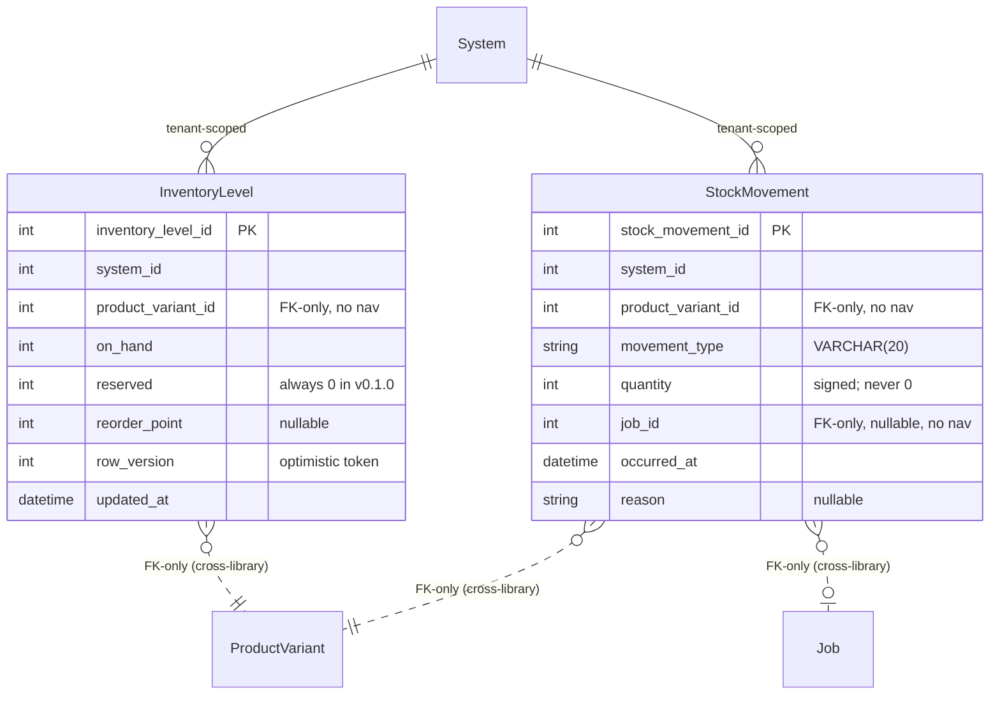
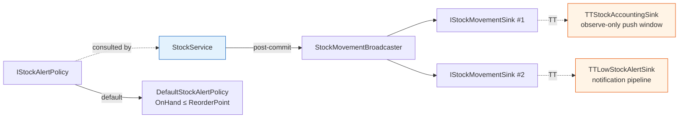

# Architecture

## Entity relationships



**Key constraints:**
- One `InventoryLevel` per `(system_id, product_variant_id)` (unique `ux_inventory_level_system_variant`).
- `product_variant_id` (both tables) and `job_id` are **FK-only typing** — `int` columns with **no navigation property**. The lib never compile-time depends on `@chthonic/catalog` or `@chthonic/work`. Per RFC 0030 § 12 Amendment 1 12e, mirroring `ScheduleSlot.JobId` ([RFC 0029](../../../architecture/rfcs/0029-dispatch-board.md)) and the platform [cross-library FK-only pattern](../../platform/extension-patterns.md).
- `stock_movement` is **append-only** — rows are never updated or deleted; a correction is a new compensating movement.
- `InventoryLevel.OnHand` is a **materialised sum** of the variant's movements, maintained transactionally by `RecordMovementAsync` (not recomputed on read).

## The level ↔ movement invariant

`OnHand` and the `stock_movement` ledger are two views of the same truth:

```
InventoryLevel.OnHand  ==  Σ StockMovement.Quantity  (for that system + variant)
```

`RecordMovementAsync` is the only writer that maintains it — it inserts the movement row **and** applies the signed delta to the level row in **one `SaveChanges` unit of work**. There is no separate "adjust level" path that could drift.

## RecordMovementAsync — signed-delta apply under optimistic concurrency

```mermaid
sequenceDiagram
    participant Caller as Consumer (TT job-save)
    participant Svc as StockService
    participant DB as DbContext (consumer)
    participant BC as StockMovementBroadcaster
    participant Sink as IStockMovementSink(s)

    Caller->>Svc: RecordMovementAsync(movement, allowNegative)
    loop up to 3 attempts
        Svc->>DB: load InventoryLevel (system, variant)
        alt no level row
            Svc->>Svc: synthesise OnHand=0, Reserved=0
        end
        Svc->>Svc: newOnHand = OnHand + movement.Quantity
        alt newOnHand < 0 AND !allowNegative
            Svc-->>Caller: throw InsufficientStockException
        end
        Svc->>Svc: OnHand = newOnHand; RowVersion++; UpdatedAt = now
        Svc->>DB: Add(movement); SaveChanges (level delta + movement row)
        alt DbUpdateConcurrencyException
            Svc->>DB: ChangeTracker.Clear()
            Note over Svc: retry (RowVersion moved under us)
        else success
            Note over Svc: break
        end
    end
    Svc->>BC: BroadcastAsync(movement)   %% post-commit
    par each registered sink
        BC->>Sink: OnMovementAsync(movement)
        Note over Sink: failure logged, never rethrown
    end
    Svc-->>Caller: saved StockMovement
```

**Why optimistic, not a trigger?** RFC 0030 § 12 Amendment 1 12i: F9 deliberately avoids MySQL triggers so it carries **no `log_bin_trust_function_creators` prerequisite** (the operational trap that bit the PR 08 dispatch-board triggers on prod). `RowVersion` is a plain `int` token marked `IsConcurrencyToken()` and hand-incremented — portable across MySQL and the SQLite test provider without a DB-generated `rowversion`.

## Broadcaster + sinks



- `IStockMovementSink` is **multi-subscriber** (`0..n`). `StockMovementBroadcaster` invokes every registered sink *after* the movement is durably committed. A sink throwing is caught + logged — a broken subscriber can never fail the stock write (RFC 0030 § 12 Amendment 1 12g).
- `IStockAlertPolicy` is a **single replaceable** service (registered via `TryAddSingleton`, so a consumer can override). `GetLowStockAsync` does a broad-phase SQL filter (`reorder_point` set) then a precise-phase in-memory pass through the policy.
- TorqueTech registers **two** sinks — a `TTStockAccountingSink` (gated by the observe-only window config) and a `TTLowStockAlertSink` (fires the notification pipeline). See [consumption.md](consumption.md).

## Tenant scoping

Both entities carry `SystemId` and every `IStockService` method takes `systemId` as its first argument — there is no ambient tenant resolution inside the lib. The consumer derives `systemId` from the authenticated principal and passes it in.

## Cross-references

- [Consumption pattern (TT worked example)](consumption.md)
- [Extension points](extension-points.md)
- [`InventoryLevel` deep-ref](stock-on-hand.md)
- [`StockMovement` deep-ref](stock-movements.md)
- [RFC 0030](../../../architecture/rfcs/0030-stock-on-hand.md)
- [platform extension-patterns — cross-library FK-only typing](../../platform/extension-patterns.md)
