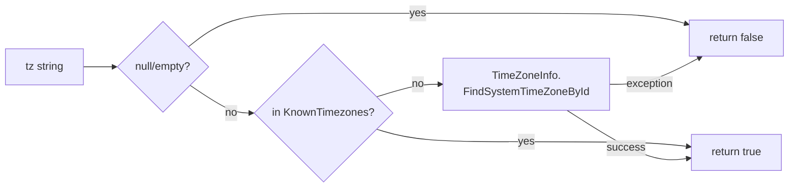

# Timezone validation

`TimezoneValidator` validates IANA timezone strings before persisting them as a tenant's `Timezone`. Bad zones at save time → bad rendering everywhere downstream, so this is the single chokepoint.

## API

```csharp
public static class TimezoneValidator
{
    public static readonly IReadOnlyList<string> KnownTimezones;

    public static bool IsValid(string? tz, ILogger? logger = null);
    public static IReadOnlyList<string> ExampleValid(int take = 10);
}
```

## Strategy



Two-stage:

1. **Curated allowlist** (`KnownTimezones`) — explicit list of ~80 IANA IDs covering every country in `CountryDefaults.CountryToTimezone`. Hits are O(1) hash lookup.
2. **Runtime probe** — fall through to `TimeZoneInfo.FindSystemTimeZoneById`. On .NET 6+ with ICU enabled, this resolves IANA IDs natively on Linux + macOS + Windows. On older runtimes / Windows-only deployments, this catches IANA IDs that the runtime understands beyond our manual list.

Failure logged at `LogDebug` (predicate contract — must return false on bad input, no exceptions).

## `KnownTimezones` content

~80 zones across:

- **Australia / Oceania** — Sydney, Melbourne, Brisbane, Perth, Adelaide, Hobart, Darwin, Auckland, Honolulu.
- **Americas** — New_York, Chicago, Denver, Los_Angeles, Phoenix, Anchorage, Toronto, Vancouver, Mexico_City, Sao_Paulo, Argentina/Buenos_Aires, Santiago, Bogota.
- **Europe** — London, Dublin, Berlin, Paris, Rome, Madrid, Amsterdam, Brussels, Vienna, Lisbon, Athens, Stockholm, Helsinki, Copenhagen, Oslo, Warsaw, Prague, Moscow, Kyiv.
- **Asia** — Tokyo, Shanghai, Hong_Kong, Singapore, Seoul, Taipei, Kolkata, Karachi, Dhaka, Colombo, Kathmandu, Manila, Kuala_Lumpur, Bangkok, Jakarta, Dubai, Riyadh, Qatar, Kuwait, Bahrain, Muscat, Amman, Baghdad.
- **Africa** — Johannesburg, Cairo, Lagos, Nairobi.
- Plus `UTC`.

Full list in `src/Chthonic.Locale/TimezoneValidator.cs` `KnownTimezones` array.

## Invariant test

`TimezoneValidatorTests` enforces:

```csharp
foreach (var country in CountryDefaultsTests.AllCountriesUnderTest)
{
    var tz = CountryDefaults.TimezoneForCountry(country);
    Assert.Contains(tz, TimezoneValidator.KnownTimezones);
}
```

i.e. every IANA ID emitted by `CountryDefaults.TimezoneForCountry` MUST be in `KnownTimezones`. This guarantees the signup flow can never auto-populate a tenant with a zone the validator would later reject.

## Adding a new IANA zone

1. Add the IANA ID to `KnownTimezones` array (preserve grouping comments).
2. If it's a country-default zone, add to `CountryDefaults.CountryToTimezone`.
3. If the platform's customer-facing surfaces should display a friendly abbreviation for this zone, add a case in `FormatHelper.FormatZoneAbbreviation`'s switch.
4. Run the test suite — both `TimezoneValidatorTests` and `CountryDefaultsTests` must pass.

## Endpoint integration

The Localization section's PUT endpoint runs:

```csharp
if (!TimezoneValidator.IsValid(input.Timezone))
{
    return Results.BadRequest(new ValidationErrorResponse
    {
        Message = "Validation failed",
        Errors = new() { ["timezone"] = $"Unknown IANA zone. Examples: {string.Join(", ", TimezoneValidator.ExampleValid())}" },
    });
}
```

`ExampleValid(10)` returns the first 10 entries of `KnownTimezones` so the 400 error tells the client what to send.

## Defensive use in `FormatHelper`

`FormatHelper.ResolveTimeZone` defensively falls back to UTC for unknown zones at render time, even though the validator should have prevented bad zones from being persisted. The defence catches legacy DB rows from before the validator existed.

## Related

- [`index.md`](index.md) — public surface.
- [`architecture.md`](architecture.md) — internals.
- [`country-defaults.md`](country-defaults.md) — companion country mapping.
- Source: `chthonicsystems/locale/src/Chthonic.Locale/TimezoneValidator.cs`.
