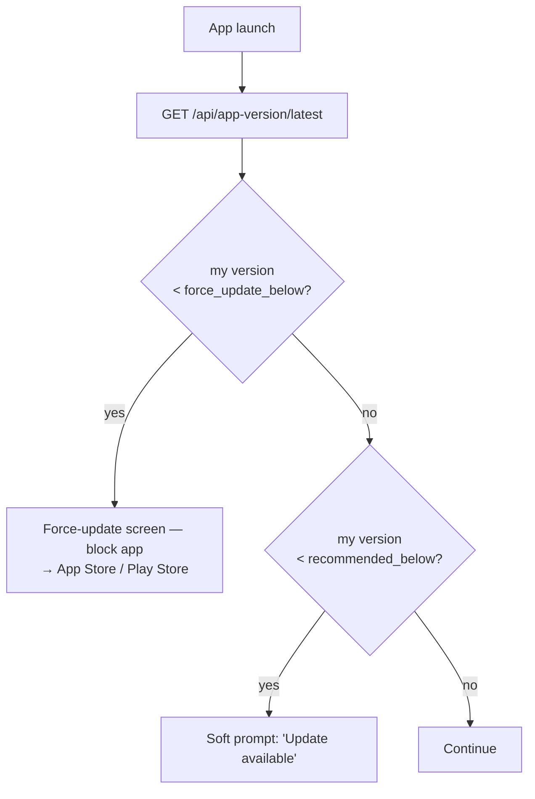

# Force-update

`checkForceUpdate(apiBaseUrl)` queries `/api/app-version/latest?platform=ios|android` (served by `@chthonic/tenant`).

## Response shape

```json
{
  "version": "14.2.1",
  "versionCode": 142001,
  "forceUpdateBelow": "14.0.0",
  "recommendedBelow": "14.1.0",
  "releaseNotes": "Bug fixes."
}
```

## Decision tree



## Force-update screen

Renders a simple full-screen with:

- "Update required" headline.
- Release notes.
- Single button: "Update now" → opens App Store / Play Store URL.

The runtime does NOT ship the screen UI itself (consumer renders); it just returns the `requiresForceUpdate` flag.

## Related

- [`libraries/tenant/appversion.md`](../tenant/appversion.md).
- [`version-sync.md`](version-sync.md).
