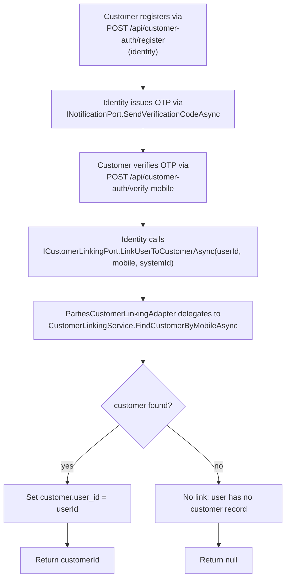

# Mobile verification (customer linking)

When a customer registers via identity's customer-auth flow, parties handles the mobile→customer match.

## Flow

## Mobile matching

- Mobile is **E.164 normalised** on both sides of the comparison.
- Match is **exact** — no fuzzy / partial / range matching.
- Lookups indexed by `(system_id, mobile)`.

`+61400123456` matches `+61400123456` only. `+61400123456` does NOT match `0400123456` after normalisation lookups (parties normalises both to `+61400123456`, then matches).

## Late linking

If a customer registers before staff create the matching customer record:
- The user has `User.CustomerId = null` initially.
- When staff later creates `Customer { mobile: '+61400123456', ... }` for the same mobile, the create endpoint also calls `CustomerLinkingService.FindUsersByMobileAsync` (looking the OTHER way) and sets `customer.user_id = matched_user_id` if exactly one match.
- If multiple users have the same mobile (rare; data quality issue), the link is left unset; admins reconcile manually.

## Re-linking

Updating a customer's mobile DOES NOT auto-re-link to a different user. Mobile change at the customer level keeps the existing `user_id` in place. If a customer wants to change their mobile + re-link, admin support intervention is required.

## Why mobile (not email)?

The customer-auth flow uses mobile because:
- Many customers don't have email (residential customers in some markets).
- SMS OTP is the simplest universally-deliverable second factor.
- Mobile is unique enough at the system-tenant level for the linking heuristic to work.

## Related

- [`libraries/identity/customer-auth.md`](../identity/customer-auth.md) — counterpart registration flow.
- [`customers.md`](customers.md) — customer entity + endpoints.
- [`extension-points.md`](extension-points.md) — `PartiesCustomerLinkingAdapter`.
- [RFC 0004](https://github.com/chthonicsystems/architecture/blob/main/rfcs/0004-multi-tenancy-and-identity.md) § Customer auth.
