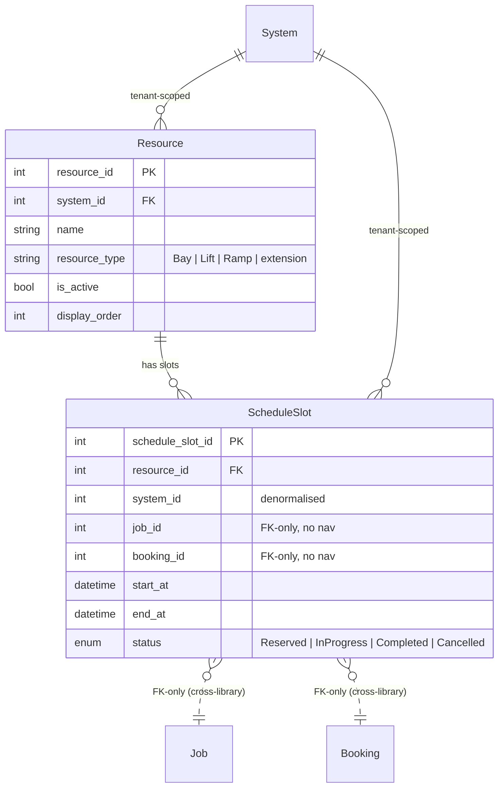
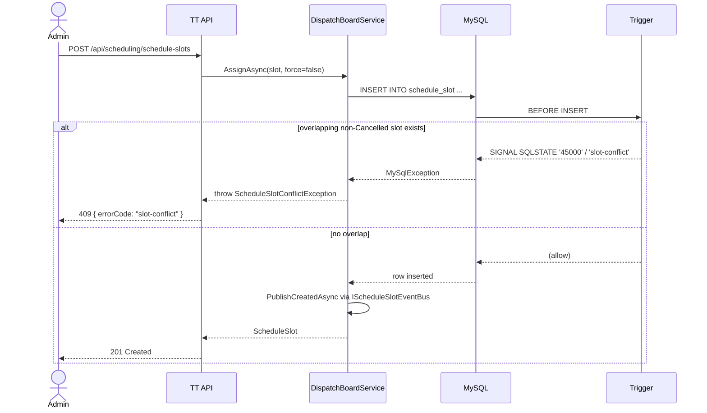

# Architecture

## Entity relationships



**Key constraints:**
- One Resource per `(system_id, name)` (unique index).
- A ScheduleSlot is either Job-pinned XOR Booking-pinned in v0.1.0 (no enforcement; convention).
- Cross-library FK on `JobId` and `BookingId` is **FK-only typing** — no nav property; the lib never compile-time depends on `@chthonic/work` or `@chthonic/booking`. Per [RFC 0008 amendment](../../../architecture/rfcs/0008-cross-library-fk.md) + RFC 0029 § 4.

## Conflict-detection flow



**Force-override path:**

```mermaid
sequenceDiagram
    actor Admin
    participant TT as TT API
    participant Svc as DispatchBoardService
    participant DB as MySQL
    participant Trig as Trigger

    Admin->>TT: POST /api/scheduling/schedule-slots?force=true
    Note over TT: action:override-slot-conflict required
    TT->>Svc: AssignAsync(slot, force=true)
    Svc->>DB: SET @sx_bypass_overlap_check = 1
    Svc->>DB: INSERT INTO schedule_slot ...
    DB->>Trig: BEFORE INSERT
    Trig->>Trig: bypass check; short-circuit
    Trig-->>DB: (allow)
    DB-->>Svc: row inserted
    Svc->>DB: SET @sx_bypass_overlap_check = NULL
    Svc-->>TT: ScheduleSlot
    TT-->>Admin: 201 Created
```

## Extension-hook architecture

```mermaid
graph LR
    DBS[DispatchBoardService<br/>default impl]
    RTP[IResourceTypeProvider]
    SBE[IScheduleSlotEventBus]
    PP[IDispatchBoardPolicyProvider]
    DRT[DefaultResourceTypeProvider<br/>Bay|Lift|Ramp]
    NSE[NoOpScheduleSlotEventBus<br/>logger only]
    HRO[HardRejectOverlapPolicy<br/>returns false]
    TT[TTScheduleSlotEventBus<br/>FCM/APNS push]

    DBS -.uses.-> RTP
    DBS -.uses.-> SBE
    DBS -.uses.-> PP
    RTP -->|default| DRT
    SBE -->|default| NSE
    PP -->|default| HRO
    SBE -.replaced by TT.-> TT

    style DBS fill:#e3f2fd,stroke:#1565c0
    style TT fill:#fff4e6,stroke:#e65100
```

Consumer apps replace defaults via `services.Replace(...)` (or `services.Remove + services.Add` for the simpler pattern). TorqueTech replaces `IScheduleSlotEventBus` with `TTScheduleSlotEventBus`; the other two hooks use defaults.

## Tenant scoping

Both entities are tenant-scoped via `SystemId`. The `schedule_slot` table denormalises `system_id` from its `resource_id` parent for fast filter on the hot dispatch-board query (`GET /api/dispatch-board?from=&to=`) without a JOIN. `DispatchBoardService.AssignAsync` derives `SystemId` from the parent Resource at insert; `ReassignAsync` re-derives if the new resource is in a different system (rare; programming error otherwise).

## Cross-references

- [Consumption pattern](consumption.md)
- [Extension points](extension-points.md)
- [ScheduleSlot deep-ref](schedule-slots.md)
- [RFC 0029](../../../architecture/rfcs/0029-dispatch-board.md)
- [`@chthonic/work` v0.8.0](../work/index.md)
