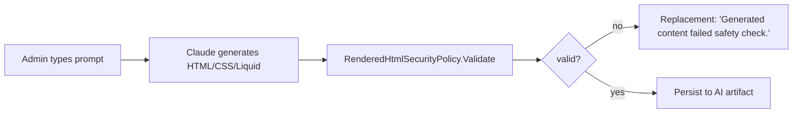

# AI-output sanitization

`@chthonic/ai` produces HTML/CSS/Liquid templates by calling Claude. Output validation prevents script injection, malicious markup, and out-of-policy content.

## RenderedHtmlSecurityPolicy

Server-side allowlist. Runs on every AI-rendered template before the consumer persists it.

```csharp
public class RenderedHtmlSecurityPolicy
{
    protected virtual HashSet<string> AllowedTags { get; } = new() {
        "div", "span", "p", "h1", "h2", "h3", "h4", "h5", "h6",
        "a", "img", "ul", "ol", "li", "table", "thead", "tbody", "tr", "td", "th",
        "strong", "em", "br", "hr", "blockquote", "code", "pre",
        "style"  // allowed; CSS scoped to the template's iframe at render time
    };

    protected virtual HashSet<string> AllowedAttributes { get; } = new() {
        "class", "id", "href", "src", "alt", "width", "height",
        "colspan", "rowspan", "scope"
    };

    protected virtual string[] AllowedHrefSchemes { get; } = new[] { "https", "mailto", "tel" };
    protected virtual string[] AllowedSrcSchemes { get; } = new[] { "https", "data:image/" };

    public ValidationResult Validate(string html);
}
```

Returns `ValidationResult.Ok` or a list of violations (disallowed tag at index N, scheme not in allowlist, etc.).

## Reject list (always blocked)

- `<script>` tag.
- `<iframe>`, `<object>`, `<embed>` tags.
- Inline `style="…"` attribute (use `<style>` block + `class` instead).
- Inline event handlers (`onclick`, `onerror`, …).
- `javascript:` URLs.
- `data:text/html` URLs (only `data:image/*` allowed).

## ListingHtmlSecurityPolicy (PR 18 extraction)

For public listings (anonymous-readable surface). Stricter:

- No `<style>` tag (CSS must come from a separate trusted source).
- No external `` outside an allowlist of CDNs.
- No `data:` URLs at all.

`ListingHtmlSecurityPolicy` extends `RenderedHtmlSecurityPolicy` + overrides the allowlists.

## AI workflow integration



Failed validation → log original to AI session log + serve placeholder. Admin sees "AI couldn't produce safe output, please refine prompt".

## Liquid-specific concerns

After Liquid renders (server-side), the result is HTML — validated by `RenderedHtmlSecurityPolicy`. Liquid filters can themselves emit unsafe output if not carefully written; the library's locale filters are safe (numeric / date strings only).

## Related

- [`iframe-isolation.md`](iframe-isolation.md) — render-time defense.
- [`libraries/ai/ai-tool-loop.md`](../ai/ai-tool-loop.md) — AI infra integration.
- [`libraries/listings/`](../listings/), [`libraries/documents/`](../documents/) — consumers.
