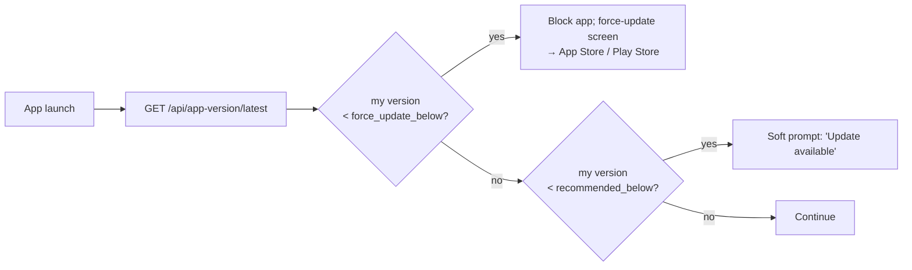

# AppVersion

Tracks released native-app versions for force-update + recommended-update gating in mobile builds.

## Schema

```
app_version
  app_version_id  int PK
  platform        enum     'ios' | 'android'
  version         varchar  semver, e.g. '14.2.1'
  version_code    int      monotonically increasing
  force_update_below   varchar?  e.g. '14.0.0' — clients below this get a force-update screen
  recommended_below    varchar?  clients below this see "update available"
  release_notes        text
  released_at          datetime
```

## Endpoints

```
GET /api/app-version/latest?platform=ios|android
→ { version, versionCode, forceUpdateBelow, recommendedBelow, releaseNotes }

POST /api/app-version          # admin-only: register a new release
PUT  /api/app-version/{id}     # admin-only: edit release notes
```

## Mobile flow

`@chthonicsystems/mobile-runtime` calls `/api/app-version/latest?platform=...` at app launch.



`force_update_below` is the killswitch — mid-extraction PR 08 used this to flag-day mobile clients to v14.0 after the Vehicle → Asset rename.

## Sync from `web/app_version.json`

The mobile-runtime build pipeline reads `web/app_version.json` and stamps the resolved version into `build.gradle` (Android) and `project.pbxproj` (iOS). On release, the same version is registered server-side via `POST /api/app-version`.

## Related

- [`index.md`](index.md), [`architecture.md`](architecture.md).
- [`libraries/mobile-runtime/force-update.md`](../mobile-runtime/force-update.md) — client implementation.
- [RFC 0018 — Mobile Shell Strategy](https://github.com/chthonicsystems/architecture/blob/main/rfcs/0018-mobile-shell-strategy.md).
