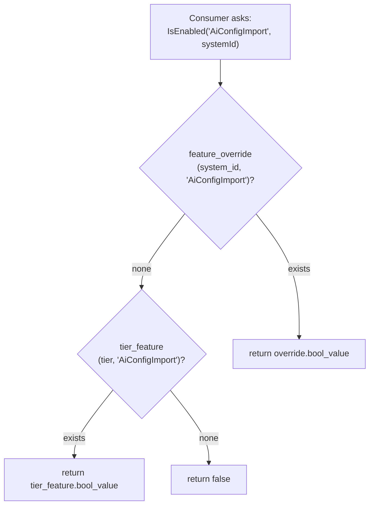

# Architecture

## File layout

```
src/Chthonic.Tenant/
├── Abstractions/Ports.cs           # ITenantSignupCompletedHandler, etc.
├── Auth/
│   ├── ITenantSignupCompletedHandler.cs
│   ├── SignupCheckoutMetadata.cs
│   ├── TenantSignupOrchestrator.cs
│   ├── TenantSubscriptionEventHandler.cs   # Stripe webhook handler (subscriptions)
│   └── TenantSubscriptionService.cs
├── AppVersionApi/AppVersionEndpoints.cs    # /api/app-version/*
├── Configuration/
│   ├── SystemConfiguration.cs              # System entity EF config
│   ├── SystemPackageConfiguration.cs       # Slim post-PR-03c shape
│   ├── AppVersionConfiguration.cs
│   ├── Entitlements/
│   │   ├── TierConfiguration.cs
│   │   ├── TierLimitConfiguration.cs
│   │   ├── TierFeatureConfiguration.cs
│   │   ├── FeatureOverrideConfiguration.cs
│   │   └── QuotaUsageConfiguration.cs
│   └── TenantSettings/
│       ├── SystemConfigurationConfiguration.cs       # 1:1 SystemConfiguration
│       ├── SystemPaymentTermsConfiguration.cs        # 1:1 payment terms
│       ├── SystemTaxConfigurationConfiguration.cs    # 1:1 tax config
│       └── SystemTerminologyConfiguration.cs         # 1:1 terminology overrides
├── Domain/
│   ├── System.cs
│   ├── SystemPackage.cs
│   ├── PlanTier.cs                  # enum: Free, Standard, Premium
│   ├── AppVersion.cs
│   └── TenantSettings.cs            # SystemConfiguration etc. partials
├── Entitlements/
│   ├── EntitlementContext.cs        # ambient context (currently SystemId-only)
│   ├── FeatureGateService.cs        # IFeatureGateService
│   ├── FeatureOverride.cs
│   ├── (LimitService.cs, TierLimit.cs, TierFeature.cs, etc.)
│   └── (... ~15 files)
├── Migrations/                      # EF migrations
├── Systems/SystemService.cs
├── ConfigHubEndpoints.cs            # /api/config-hub/status (aggregate)
├── TenantSettingsEndpoints.cs       # /api/systems/my-system/{section} GET/PUT
├── TenantModuleMarker.cs
└── ServiceCollectionExtensions.cs
```

## Schema (bare table names)

```
system (system_id, name, country, logo_url, contact_email, ..., created_at, ...)
system_package (system_id, tier, stripe_customer_id, stripe_subscription_id, trial_ends_at, expires_at)

# 1:1 settings tables
system_configuration (system_id, date_format, number_format, currency, timezone)
system_payment_terms (system_id, default_payment_days, grace_days, reminders_enabled)
system_tax_configuration (system_id, tax_name, tax_rate, tax_inclusive, tax_registration_number)
system_terminology (system_id, key, value)        # PK is composite (system_id, key)

# Entitlements
tier (tier_id, name, description)                  # Free / Standard / Premium
tier_limit (tier_id, limit_name, int_value)        # MaxUsers, MaxJobsPerDay, ...
tier_feature (tier_id, feature_name, bool_value)   # enabled by default per tier
feature_override (system_id, feature_name, bool_value, int_value)   # per-tenant override
quota_usage (system_id, quota_name, period, count, last_reset_at)

app_version (id, platform, version, version_code, force_update_below, recommended_below, release_notes)
smart_link (id, type, target_url, expires_at)
```

`SystemPackage` was slimmed in PR 03c: `MaxUsers`, `MaxJobsPerDay`, etc. were lifted to `tier_limit` rows + `feature_override`. `SystemPackage` now keeps subscription identity only (Tier + Stripe IDs).

## Entitlements model



Same shape for `ILimitService.GetLimitAsync(name, systemId)`:

1. `feature_override.int_value` for `(system_id, name)` → returns it.
2. `tier_limit.int_value` for `(tier, name)` → returns it.
3. Fallback `int.MaxValue` (= "unlimited").

`-1` in `int_value` means unlimited explicitly.

## Adding a new flag or limit

= insert a row in `tier_feature` or `tier_limit` (per tier). NO library release.

```sql
INSERT INTO tier_feature (tier_id, feature_name, bool_value)
SELECT t.tier_id, 'NewFlag', t.name = 'Premium'
FROM tier t;
-- Premium gets it on by default; Standard + Free don't.
```

Then admins toggle per-tenant via the Config Hub Integrations section, which writes `feature_override` rows.

## Quota tracking

`quota_usage` = running counters per `(system_id, quota_name, period)`.

```csharp
// Before creating an entity that contributes to a daily/monthly quota
if (!await _limits.CheckQuotaAsync("MaxJobsPerDay", systemId))
    throw new QuotaExceededException("Daily job limit reached");

// ... create the entity ...

// After
await _limits.RecordUsageAsync("MaxJobsPerDay", systemId);
```

`CheckQuotaAsync` reads (current `count` < limit). `RecordUsageAsync` increments. Period rollover (daily / monthly) handled by reading `last_reset_at` + comparing to "now". Background scheduler resets stale counters.

## Config Hub sections (13 in 4 groups)

| Group | Sections |
|---|---|
| Business Setup | profile, localization, tax, paymentTerms, workingHours, terminology |
| Catalog | services, products |
| Display | fields, serviceScreens, views, documents |
| Integrations | integrations |

The library ships **section-agnostic** infra (the shell + status aggregation + section CRUD endpoints). Section content is consumer-supplied — see [`config-hub.md`](config-hub.md).

`profile`, `localization`, `workingHours` are **mandatory** — drive the Home "Finish setting up" banner via `useHubStatus()`.

## Tests

| File | Coverage |
|---|---|
| `FeatureGateServiceTests` | Resolution: override → tier_feature → false |
| `LimitServiceTests` | Resolution + check + record + period rollover |
| `SystemServiceTests` | Sysadmin-only create/delete; per-tenant scope |
| `TenantSubscriptionEventHandlerTests` | Stripe webhook → tier change → feature_override flush |
| `TenantSubscriptionServiceTests` | Tier resolution from Stripe sub status |
| ... | Section service tests for profile, localization, tax, payment-terms, working-hours, terminology |

## Related

- [`index.md`](index.md), [`consumption.md`](consumption.md), [`extension-points.md`](extension-points.md).
- [`entitlements.md`](entitlements.md), [`config-hub.md`](config-hub.md), [`appversion.md`](appversion.md), [`smartlink.md`](smartlink.md).
- [`platform/extension-patterns.md`](../../platform/extension-patterns.md) § "Generic entitlements".
- [RFC 0004](https://github.com/chthonicsystems/architecture/blob/main/rfcs/0004-multi-tenancy-and-identity.md).
