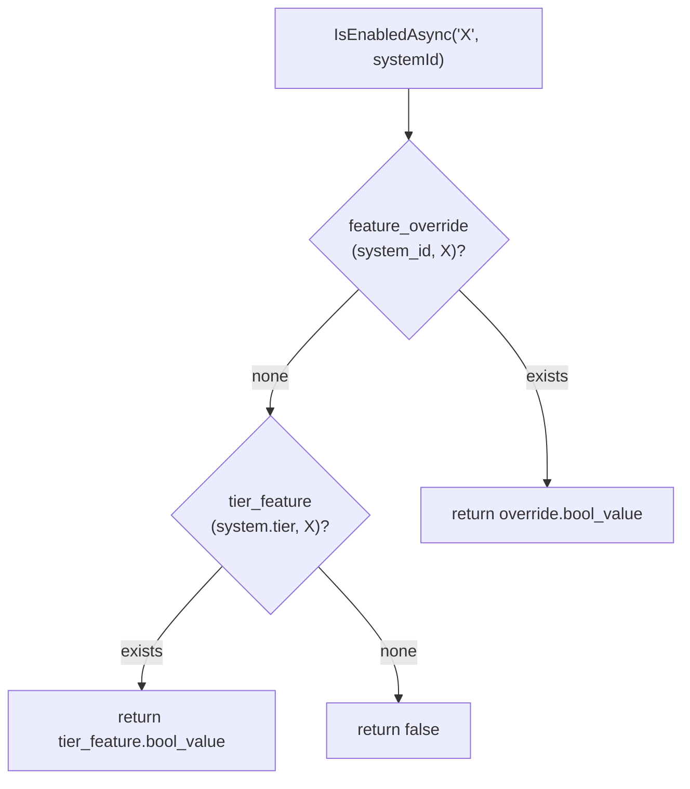

# Entitlements

Tenant owns the platform's generic entitlements model: feature flags + numeric limits + per-tenant overrides + quota tracking. **Data-driven** — adding a new flag or limit is a `tier_feature` / `tier_limit` row, NOT a library release.

## Schema

```
tier (tier_id, name, description)
  rows: 'Free', 'Standard', 'Premium'

tier_limit (tier_id, limit_name, int_value)
  PK: (tier_id, limit_name)
  example rows:
    (Standard, MaxUsers, 20)
    (Premium,  MaxUsers, -1)         # -1 = unlimited
    (Standard, MaxJobsPerDay, 50)
    (Standard, MaxAiPromptsPerMonth, 5)

tier_feature (tier_id, feature_name, bool_value)
  PK: (tier_id, feature_name)
  example rows:
    (Standard, AiConfigImport, true)
    (Premium,  AiConfigImport, true)
    (Free,     AiConfigImport, false)
    (Premium,  ListingTemplateAI, true)

feature_override (system_id, feature_name, bool_value, int_value)
  PK: (system_id, feature_name)
  example: (42, AiConfigImport, false, NULL)   # tenant-specific opt-out

quota_usage (system_id, quota_name, period, count, last_reset_at)
  PK: (system_id, quota_name, period)
  period: 'daily' | 'monthly' | etc.
```

`feature_override.int_value` carries numeric limit overrides; `bool_value` carries flag overrides. Either can be NULL.

## Resolution order



Same shape for `GetLimitAsync`:
1. `feature_override.int_value` (per-tenant) → return.
2. `tier_limit.int_value` (per-tier) → return.
3. Fallback `int.MaxValue`.

`int_value = -1` is **explicit unlimited**. Distinguish from `int.MaxValue` (= "no row exists") at the call site if you care; `CheckQuotaAsync` treats both as unlimited.

## API

```csharp
public interface IFeatureGateService
{
    Task<bool> IsEnabledAsync(string flag, int systemId);
    Task<Dictionary<string, bool>> GetSnapshotAsync(int systemId);   // for login response
}

public interface ILimitService
{
    Task<int> GetLimitAsync(string name, int systemId);              // -1 / int.MaxValue = unlimited
    Task<bool> CheckQuotaAsync(string name, int systemId);           // BEFORE creating
    Task RecordUsageAsync(string name, int systemId);                // AFTER successful create
}
```

## Quota tracking

`CheckQuotaAsync(name, systemId)`:

1. Look up `quota_usage(system_id, name, period)`.
2. If `last_reset_at` < period boundary, reset `count = 0` + update `last_reset_at`.
3. Look up `limit = GetLimitAsync(name, systemId)`.
4. Return `count < limit` (or always true if `limit < 0`).

`RecordUsageAsync(name, systemId)`:

1. Upsert `quota_usage(system_id, name, period)` with `count = count + 1`.

Period rollover happens on read, so a tenant inactive for a day still gets a fresh count when activity resumes.

## Consumer call sites

**Before creating an entity:**

```csharp
if (!await _limits.CheckQuotaAsync("MaxJobsPerDay", systemId))
    throw new QuotaExceededException("Daily job limit reached");

var job = await _repo.AddAsync(input);

await _limits.RecordUsageAsync("MaxJobsPerDay", systemId);
return job;
```

**Before exposing a feature:**

```csharp
if (!await _features.IsEnabledAsync("AiConfigImport", systemId))
    return Results.Forbidden(new ErrorResponse { Message = "Upgrade to Standard to enable AI Config Import" });
```

## Frontend

```tsx
const { enabled, loading } = useFeatureGate('AiConfigImport');
const quota = useQuota('MaxAiPromptsPerMonth');

if (loading) return <Spinner />;
if (!enabled) return <UpgradePrompt feature="AiConfigImport" />;
return <button disabled={quota.remaining <= 0}>Generate ({quota.remaining} left)</button>;
```

## Stripe webhook → tier change

`TenantSubscriptionEventHandler` consumes `checkout.session.completed`:

1. Look up `system_package(stripe_subscription_id)` → `system_id`.
2. Map Stripe subscription tier → `Free`/`Standard`/`Premium`.
3. Update `system_package.tier`.
4. **Optionally flush `feature_override` rows** that conflict with the new tier (e.g. drop a "Premium" override when downgrading to Standard) — implementation choice, currently kept (admins reapply manually).

## Tier migration on downgrade

When a tenant downgrades, their existing data may exceed the new tier's limits (e.g. 25 users on Standard's MaxUsers=20). The library does **not** auto-delete excess data. The Config Hub displays a warning banner; admins must manually deactivate excess users / archive jobs / etc.

This is a deliberate UX choice — accidentally deleting customer data on a downgrade would be worse than displaying a warning.

## Tests

| Test | Coverage |
|---|---|
| `FeatureGateServiceTests.IsEnabledResolutionOrder` | Override → tier_feature → false |
| `LimitServiceTests.GetLimitResolutionOrder` | Override → tier_limit → MaxValue |
| `LimitServiceTests.CheckQuotaPeriodRollover` | Reset on period boundary |
| `LimitServiceTests.UnlimitedTier` | -1 limit → CheckQuota always true |
| `TenantSubscriptionEventHandlerTests.TierChangeFlushesOverrides` | Webhook → tier change |

## Related

- [`index.md`](index.md), [`architecture.md`](architecture.md), [`consumption.md`](consumption.md), [`extension-points.md`](extension-points.md).
- [`config-hub.md`](config-hub.md) — Integrations section UI for overrides.
- [`platform/extension-patterns.md`](../../platform/extension-patterns.md) § "Generic entitlements".
- [RFC 0004](https://github.com/chthonicsystems/architecture/blob/main/rfcs/0004-multi-tenancy-and-identity.md) § Entitlements.
