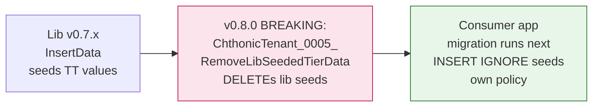

# Seeding policy

Per [RFC 0039 — Tier-seed locality](https://github.com/chthonicsystems/architecture/blob/main/rfcs/0039-tier-seed-locality.md),
`@chthonicsystems/tenant` v0.8.0+ owns **schema only** for the
entitlements model. Consumer applications own **tier policy** —
the values that go into `tier`, `tier_limit`, and `tier_feature`.

## Why

Pre-v0.8.0, the lib's `_0001_Initial` migration seeded TT-specific
values (Free/Standard/Premium tier names; `MaxJobsPerDay`,
`MaxListingPhotos`, `MaxBookingSlotsPerDay` limit keys; `Invoice`,
`Estimate`, `JobCardTemplateModern`, `AiConfigImport` feature keys).
Sister products (MarineDeck, FlowLift, PetCare OS) consuming the
lib inherited TT's flags whether they wanted them or not.

v0.8.0 strips the lib seeds; consumer apps re-assert their canonical
policy via their own idempotent seed migration after the lib's
cleanup runs.

## Mechanism



EF runs migrations in timestamp order across all DbContexts — the
lib's cleanup runs first, then the consumer's seed; both inside the
same `dotnet ef database update` invocation at app boot.

## Required consumer pattern

Each consumer app ships a seed migration with a timestamp **after**
the lib's `_0005_RemoveLibSeededTierData` migration. Use
`INSERT IGNORE` (MySQL) or `ON CONFLICT DO NOTHING` (Postgres) for
idempotency against existing prod where rows are still in the DB
from the v0.7.x era.

### Example (MySQL — the pattern TorqueTech uses)

```csharp
public partial class SeedTierEntitlements : Migration
{
    protected override void Up(MigrationBuilder migrationBuilder)
    {
        migrationBuilder.Sql(@"
            INSERT IGNORE INTO tier (tier_id, name, sort_order, description) VALUES
                (1, 'Free',     0, 'Free tier'),
                (2, 'Standard', 1, 'Standard tier'),
                (3, 'Premium',  2, 'Premium tier');");

        migrationBuilder.Sql(@"
            INSERT IGNORE INTO tier_limit (tier_id, `key`, value) VALUES
                (1, 'MaxUsers', 5),
                (2, 'MaxUsers', 20),
                (3, 'MaxUsers', -1),       -- -1 = unlimited
                ...your full policy...;");

        migrationBuilder.Sql(@"
            INSERT IGNORE INTO tier_feature (tier_id, feature_key) VALUES
                (1, 'Notifications'),
                (2, 'Notifications'),
                ...your full default-on set...;");
    }

    protected override void Down(MigrationBuilder migrationBuilder)
    {
        // No-op — rolling back deletes the lib-cleanup row in
        // __EFMigrationsHistory but the consumer's seed is its
        // own canonical source.
    }
}
```

## Sister products

- **TorqueTech** ships `SeedTierEntitlementsAndVideoSizeCap` (PR 05)
  — Free / Standard / Premium tiers; TT-specific limit + feature
  keys; new `MaxVideoSizeBytes` entry.
- **MarineDeck / FlowLift / PetCare OS** ship their own seed
  migrations with their own tier names + limit keys + feature keys
  when they reach the post-extraction integration phase.

## Override-precedence (unchanged)

Lib services (`IFeatureGateService`, `ILimitService`) read
`tier_*` rows the consumer seeded, then per-system
`feature_override` rows for runtime overrides. This is unchanged
from v0.7.x.

## Tests

The lib's xUnit suite uses `EntitlementsTestHarness` which seeds
programmatically — independent of any migration's `InsertData`.
Consumer-side tier-specific assertions belong in the consumer's own
test suite (e.g. TorqueTech's `SignupServiceTests`,
`LimitServiceTests`).

## Cross-references

- [RFC 0039 — Tier-seed locality](https://github.com/chthonicsystems/architecture/blob/main/rfcs/0039-tier-seed-locality.md)
- [`index.md`](index.md), [`entitlements.md`](entitlements.md)
- [`tenant/CHANGELOG.md` v0.8.0 entry](https://github.com/chthonicsystems/tenant/blob/main/CHANGELOG.md)
