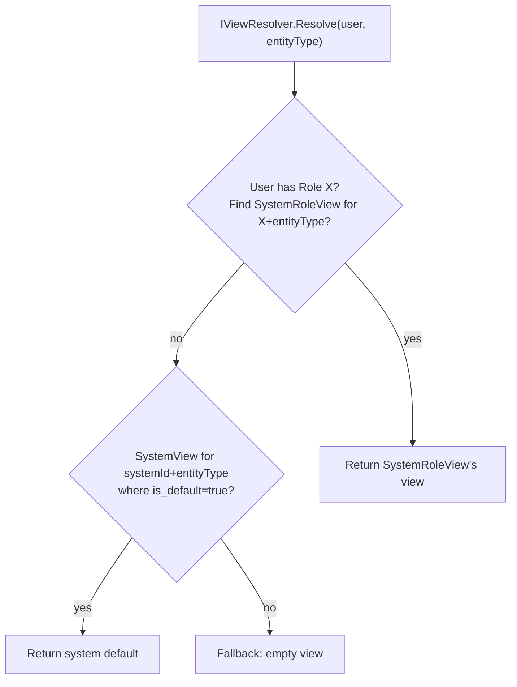

# Architecture

## Schema

```
system_view
  system_view_id  int PK
  system_id       int
  name            varchar(200)
  description     text?
  entity_type     varchar(50)    'Job', 'Customer', 'Vessel', ...
  is_default      bool
  is_quick        bool
  display_order   int

system_role_view
  system_role_view_id  int PK
  system_view_id       int FK
  role_id              int FK
  is_default           bool
  is_quick             bool

system_entity_field_category
  category_id     int PK
  system_view_id  int FK
  entity_type     varchar(50)
  name            varchar(100)
  display_order   int
  icon            varchar(100)?

system_entity_field_sub_category
  sub_category_id  int PK
  category_id      int FK
  name             varchar(100)
  display_order    int
  icon             varchar(100)?

system_entity_field
  entity_field_id  int PK
  system_view_id   int FK
  entity_type      varchar(50)
  category_id      int FK?
  sub_category_id  int FK?
  name             varchar(100)
  data_type        enum 'Text','Numeric','Date','Checkbox','Options','Combo','MultiValueOptions',...
  is_required      bool
  is_free_text     bool
  is_multi_select  bool
  display_order    int
  linked_field_name varchar(100)?  # links to ServiceItem.Cost / Product / etc.

system_entity_field_option
  option_id  int PK
  entity_field_id int FK
  value      varchar(255)
  price      decimal(10,2)?
  display_order int

system_entity_field_role
  entity_field_id int FK
  role_id    int FK
  PK (entity_field_id, role_id)

system_entity_field_status
  entity_field_id int FK
  status     varchar(50)
  PK (entity_field_id, status)

entity_field_value
  entity_field_value_id int PK
  entity_field_id  int FK
  entity_type      varchar(50)
  entity_id        int
  value            text?
  index ix_efv_entity (entity_type, entity_id)
```

## View resolution



## Polymorphic FK pattern

`entity_field_value.(entity_type, entity_id)` is the polymorphic FK. The library doesn't know what entity types exist; consumers pass strings (`'Job'`, `'Customer'`, `'Vessel'`).

`system_view.entity_type` and `system_entity_field.entity_type` discriminate views/fields per entity type within a tenant.

## Tests

Per RFC 0010 + PR 11/11b/11c, ~40+ targeted Playwright specs cover the dynamic-field rendering. Library xUnit covers service resolution, EF configurations, schema rename migrations.

## Related

- [`custom-fields.md`](custom-fields.md), [`entity-field-discriminator.md`](entity-field-discriminator.md), [`screen-sections-renderer.md`](screen-sections-renderer.md), [`auto-providers.md`](auto-providers.md).
- [RFC 0010](https://github.com/chthonicsystems/architecture/blob/main/rfcs/0010-views-and-custom-fields.md).
