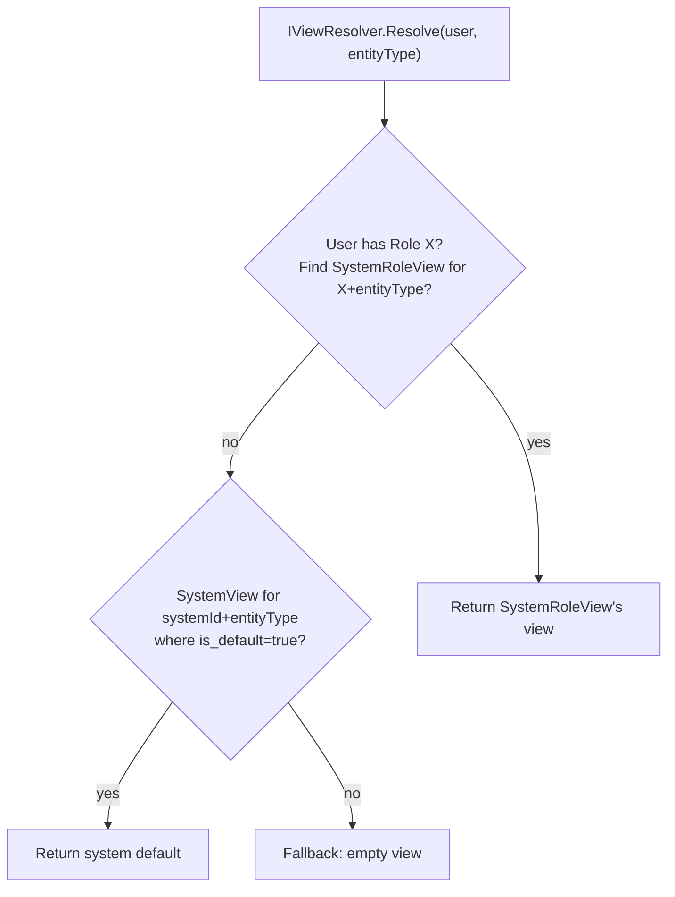
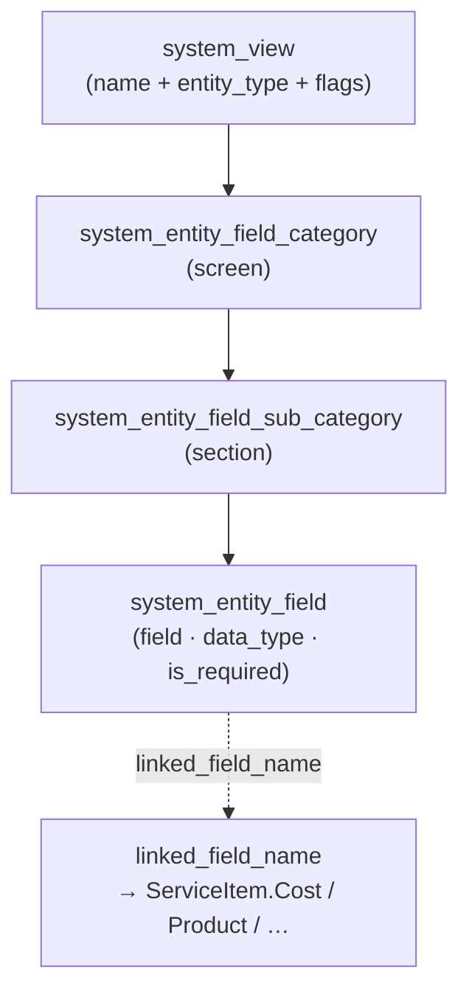

# Architecture

## Schema

```
system_view
  system_view_id  int PK
  system_id       int
  name            varchar(200)
  description     text?
  entity_type     varchar(50)    'Job', 'Customer', 'Vessel', ...
  is_default      bool
  is_quick        bool
  display_order   int

system_role_view
  system_role_view_id  int PK
  system_view_id       int FK
  role_id              int FK
  is_default           bool
  is_quick             bool

system_entity_field_category
  category_id     int PK
  system_view_id  int FK
  entity_type     varchar(50)
  name            varchar(100)
  display_order   int
  icon            varchar(100)?

system_entity_field_sub_category
  sub_category_id  int PK
  category_id      int FK
  name             varchar(100)
  display_order    int
  icon             varchar(100)?

system_entity_field
  entity_field_id  int PK
  system_view_id   int FK
  entity_type      varchar(50)
  category_id      int FK?
  sub_category_id  int FK?
  name             varchar(100)
  data_type        enum 'Text','Numeric','Date','Checkbox','Options','Combo','MultiValueOptions',...
  is_required      bool
  is_free_text     bool
  is_multi_select  bool
  display_order    int
  linked_field_name varchar(100)?  # links to ServiceItem.Cost / Product / etc.

system_entity_field_option
  option_id  int PK
  entity_field_id int FK
  value      varchar(255)
  price      decimal(10,2)?
  display_order int

system_entity_field_role
  entity_field_id int FK
  role_id    int FK
  PK (entity_field_id, role_id)

system_entity_field_status
  entity_field_id int FK
  status     varchar(50)
  PK (entity_field_id, status)

entity_field_value
  entity_field_value_id int PK
  entity_field_id  int FK
  entity_type      varchar(50)
  entity_id        int
  value            text?
  index ix_efv_entity (entity_type, entity_id)
```

## View resolution



## Hierarchy

A view is a four-level tree: a `system_view` row owns one or more `system_entity_field_category` rows (each one a **screen** the user sees), each category owns one or more `system_entity_field_sub_category` rows (each one a **section** within that screen), and each sub-category owns one or more `system_entity_field` rows (the **fields** the user fills in).



`system_entity_field.linked_field_name` is the bridge into the consumer's catalog: when set, the field reads its default value from a named property on a related entity (e.g. `ServiceItem.Cost` populates a price field on a job's parts row). The link is name-based rather than FK-typed so the library stays decoupled from any consumer's catalog schema.

## Per-service variant

A second use of `system_view` is the **per-service variant**: a `system_view` row that represents the layout for a single service in the consumer's catalog rather than for an entity-type as a whole. Consumers add a nullable `service_id` column to `system_view` (and a pair of host-view flags such as `include_service_screens` / `auto_service_screens`) so a host view can opt into merging per-service screens onto the assembled tree at render time.

The composition happens during view resolution. When the host view has `include_service_screens = true`, every linked service on the entity (e.g. each service line on a job) contributes its per-service `system_view` rows on top of the host's own screens. When `auto_service_screens = true` is also set, services that have **no** persisted per-service `system_view` get a synthetic screen built from catalog rows at render time — the library exposes this via `IAutoScreenProvider<TEntity>` (see [`auto-providers.md`](auto-providers.md)). Configured per-service screens take precedence over auto-generated ones for the same service.

### Bootstrap convention

Consumers typically seed a "Default View" with `include_service_screens = true` and `auto_service_screens = true` at tenant-creation time, and point `system.default_view_id` and `system.job_card_view_id` at it. The result is that jobs render correctly without any admin configuration: every service in the catalog gets a per-service screen automatically, with admin-configured screens taking over for any service the workshop wants to customise. Admins only touch the View Wizard when they want to override the defaults.

## Polymorphic FK pattern

`entity_field_value.(entity_type, entity_id)` is the polymorphic FK. The library doesn't know what entity types exist; consumers pass strings (`'Job'`, `'Customer'`, `'Vessel'`).

`system_view.entity_type` and `system_entity_field.entity_type` discriminate views/fields per entity type within a tenant.

## Tests

Per RFC 0010 + PR 11/11b/11c, ~40+ targeted Playwright specs cover the dynamic-field rendering. Library xUnit covers service resolution, EF configurations, schema rename migrations.

## Related

- [`custom-fields.md`](custom-fields.md), [`entity-field-discriminator.md`](entity-field-discriminator.md), [`screen-sections-renderer.md`](screen-sections-renderer.md), [`auto-providers.md`](auto-providers.md).
- [RFC 0010](https://github.com/chthonicsystems/architecture/blob/main/rfcs/0010-views-and-custom-fields.md).
