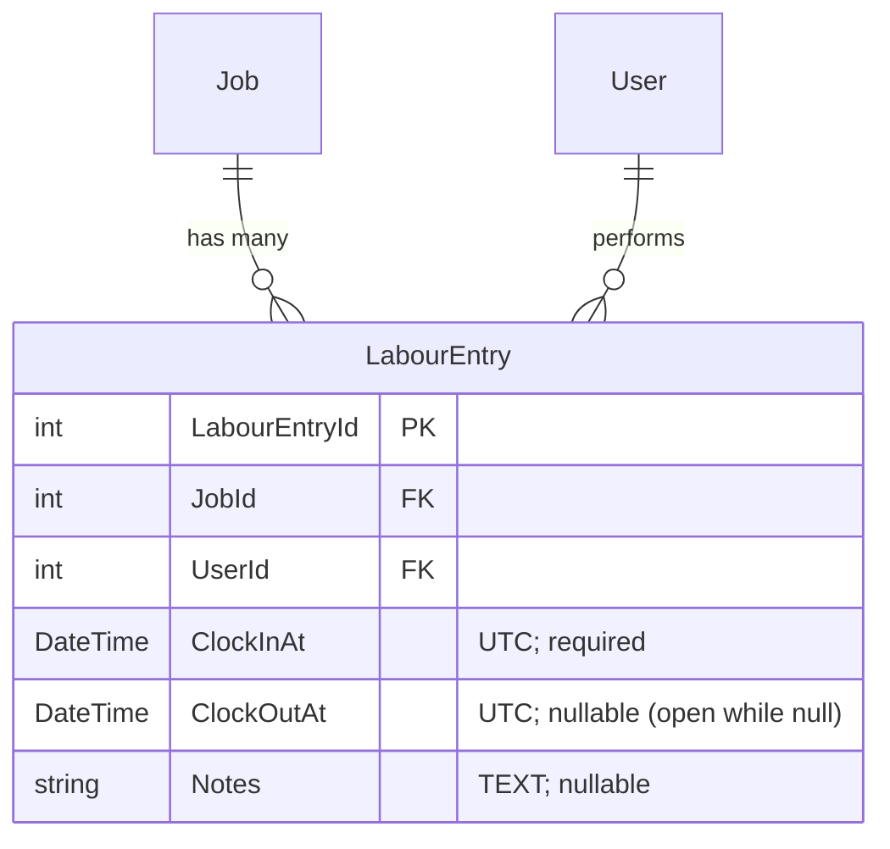

# Labour clocking

Per-mechanic clock-in / clock-out timeline attached to a Job. One
`LabourEntry` row per work session: opened on
`POST /labour/clock-in`, closed on `POST /labour/clock-out` or via
the consumer-side auto-clock-out hook
(TT's `TTLabourAutoClockOutHandler : IJobStatusChangedHandler`)
when the parent Job transitions to `Completed` or `PendingQcSignoff`.

Shipped in `@chthonic/work` v0.3.0 per
[RFC 0025 § 4 Public API](https://github.com/chthonicsystems/architecture/blob/main/rfcs/0025-labour-clocking.md#4-public-api-surface).
Consumed by F4 (PR 02 / TT) and F16 (PR 16 / RFC 0037 — mechanic
productivity report; aggregates `LabourEntry.duration` per
`(UserId, week)`).

## Entity diagram



Schema (snake_case `labour_entry`):

```
labour_entry
  labour_entry_id  bigint PK auto-increment
  job_id           int    NOT NULL  FK job(job_id)   ON DELETE CASCADE
  user_id          int    NOT NULL  FK users(id)     ON DELETE RESTRICT
  clock_in_at      datetime(6) NOT NULL
  clock_out_at     datetime(6) NULL          -- NULL ⇒ open
  notes            text NULL

  index ix_labour_entry_user_open  (user_id, clock_out_at)   -- O(log n) for GetOpenForUserAsync
  index ix_labour_entry_job        (job_id)                  -- ListByJob + F16 aggregation
```

## Public surface

```csharp
namespace Chthonic.Work.Domain;

[AuditParent(typeof(Job), nameof(JobId))]
public class LabourEntry
{
    public int LabourEntryId { get; set; }
    public int JobId { get; set; }
    public int UserId { get; set; }
    public DateTime ClockInAt { get; set; }
    public DateTime? ClockOutAt { get; set; }
    public string? Notes { get; set; }
    public Job Job { get; set; } = null!;
    public User User { get; set; } = null!;
}

namespace Chthonic.Work.Services;

public interface ILabourClockService
{
    Task<LabourEntry> ClockInAsync(int jobId, int userId, CancellationToken ct = default);
    Task<LabourEntry> ClockOutAsync(int labourEntryId, string? notes, CancellationToken ct = default);
    Task<IReadOnlyList<LabourEntry>> ListByJobAsync(int jobId, CancellationToken ct = default);
    Task<LabourEntry?> GetOpenForUserAsync(int userId, CancellationToken ct = default);
}

public class LabourClockOverlapException : InvalidOperationException
{
    public int OpenLabourEntryId { get; }
    public int OpenJobId { get; }
}
```

## Overlap-detect contract

`ClockInAsync` enforces **at most one open entry per user across all
jobs**. Attempting to clock in a user who already has an open entry
(regardless of which job) throws `LabourClockOverlapException`
carrying the existing entry's ids — consumers map this to a 409
response with `errorCode: "labour-clock-overlap"` so the frontend can
guide the mechanic to clock out first.

Rationale per [RFC 0025 § 9 OQ1 / § 10 Alternative 1](https://github.com/chthonicsystems/architecture/blob/main/rfcs/0025-labour-clocking.md#alternative-1-allow-concurrent-clock-in-across-jobs):
workshops want exactly-one-active-job-per-mechanic for
cost-attribution. Allowing concurrency would force F16's
productivity-report aggregation to either double-count duration
(overstates productivity) or split it 50/50 (arbitrary).

## Idempotent clock-out

`ClockOutAsync` on an already-closed entry returns the existing row
unchanged — no exception, no second close. Lets the auto-clock-out
hook (TT-side `TTLabourAutoClockOutHandler`) and a delayed manual
`POST /clock-out` coexist without race conditions.

Consumer pattern: orchestrators that wrap the service with audit /
notification side-effects should detect the no-op via a pre-state
check so they don't write duplicate semantic-action audit rows on
the second close attempt.

## Audit auto-rollup via `[AuditParent]`

`LabourEntry` carries `[AuditParent(typeof(Job), nameof(JobId))]` —
mirrors the `JobMechanic` precedent. Every CRUD on a `LabourEntry`
auto-rolls-up to the parent `Job` in the audit log via
`AuditSaveChangesInterceptor`. Consumers that want semantic action
labels (e.g. `"labour.clock-in"`, `"labour.clock-out"`,
`"labour.clock-out.auto"`) layer those on top via their own
orchestrator (TT's `LabourClockOrchestrator` writes
`AuditEntry { EventType = "labour.clock-in" }` rows in addition to
the auto-rollup).

## Auto-clock-out via `IJobStatusChangedHandler`

TT closes any open entries on the Job when its status transitions to
`Completed` or `PendingQcSignoff`. The hook is the EXISTING v0.1.0
`IJobStatusChangedHandler` — NOT the new v0.2.0
`IJobStatusTransitionValidator` introduced in PR 01. The validator
is a *gate* (`Task<bool> CanTransitionAsync` — yes/no whether the
transition is permitted); the handler is a *side-effect*
(post-commit dispatch). Auto-clock-out fires AFTER the transition
commits, so the handler is the right hook. See
[RFC 0025 § 10 Alternative 4](https://github.com/chthonicsystems/architecture/blob/main/rfcs/0025-labour-clocking.md#alternative-4-wrong-hook-for-auto-clock-out--ijobstatustransitionvalidator)
for the hook-correction journey.

```csharp
// api/Features/Jobs/Labour/TTLabourAutoClockOutHandler.cs (TT-side)
public sealed class TTLabourAutoClockOutHandler : IJobStatusChangedHandler
{
    public async Task OnJobStatusChangedAsync(
        Job job, JobStatus oldStatus, JobStatus newStatus, int userId, CancellationToken ct)
    {
        if (newStatus is not (JobStatus.Completed or JobStatus.PendingQcSignoff))
            return;

        var openEntries = await _db.LabourEntries
            .Where(l => l.JobId == job.JobId && l.ClockOutAt == null)
            .ToListAsync(ct);

        foreach (var entry in openEntries)
        {
            await _service.ClockOutAsync(
                entry.LabourEntryId, "Auto-closed on Job completion", ct);
            // System-actor audit row labour.clock-out.auto
            await _audit.LogAsync(new AuditEntry(
                SystemId: job.SystemId,
                Category: AuditCategory.BusinessAction,
                EventType: "labour.clock-out.auto",
                ActorRole: "system",
                ...
            ));
        }
    }
}
```

## Forgotten-clock-out watchdog

Consumed by TT's `TTLabourClockOpen8hWatchdog` which implements the
[`IOpenEntryWatchdog`](../notifications/open-entry-watchdog.md)
primitive shipped in `@chthonic/notifications` v0.2.0. 15-minute
scan; entries open > 8h fire a push notification to the mechanic.
The watchdog scheduler's per-UTC-day-bucketed idempotency means
"one nag per day per entry" without re-noising the mechanic every
15 minutes.

## Consuming this library

```csharp
// api/Program.cs
builder.Services.AddChthonicWork();   // also registers ILabourClockService
```

```csharp
// Usage from a consumer-side orchestrator:
public class LabourClockOrchestrator
{
    private readonly ILabourClockService _service;
    private readonly IAuditLogger _audit;

    public async Task<LabourEntry> ClockInAsync(int jobId, int userId, CancellationToken ct)
    {
        var entry = await _service.ClockInAsync(jobId, userId, ct);
        await _audit.LogAsync(new AuditEntry(
            EventType: "labour.clock-in",
            EntityType: "LabourEntry",
            EntityId: entry.LabourEntryId,
            ActorUserId: userId, ...));
        return entry;
    }
}
```

## Tests

`V030LabourClockingTests` covers shape (entity properties, AuditParent
attribute presence, Notes nullable, ClockOutAt nullable);
`LabourClockOverlapException` (id+message round-trip); service
behaviour (overlap-detect within job, across jobs, different users
no conflict; idempotent ClockOut; KeyNotFoundException on unknown
id; ClockOut-then-ClockIn lifecycle; ListByJob newest-first;
GetOpenForUser pre/post lifecycle).

## Related

- [`job-spine.md`](job-spine.md) — Job entity + `JobMechanic` precedent
- [`status-transitions.md`](status-transitions.md) — JobStatus matrix
- [`extension-points.md`](extension-points.md) — `IJobStatusChangedHandler`
- [`@chthonic/notifications` open-entry-watchdog.md](../notifications/open-entry-watchdog.md) — companion primitive
- [RFC 0025 — Labour clocking](https://github.com/chthonicsystems/architecture/blob/main/rfcs/0025-labour-clocking.md)
- [RFC 0037 — Mechanic productivity report](https://github.com/chthonicsystems/architecture/blob/main/rfcs/0037-mechanic-productivity-report.md) (downstream consumer of `LabourEntry`)
