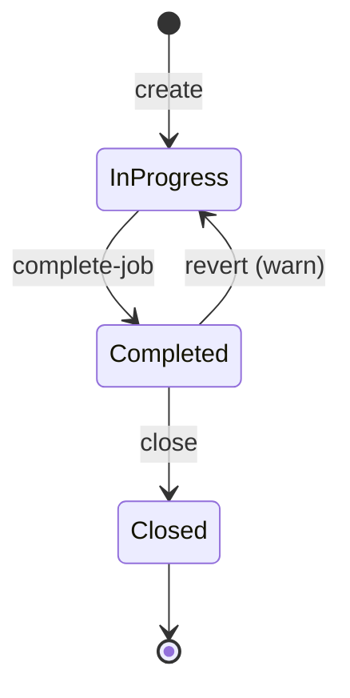

# Status transitions

`JobStatus` enum: `InProgress`, `Completed`, `Closed`. Default valid transitions:



## Status-specific permissions

The library checks permissions per transition target via the consumer's `IPermissionHelper`:

| Transition | Required permission |
|---|---|
| `* → Completed` | `action:complete-job` |
| `Completed → InProgress` | `action:edit-job` (warning UI) |
| `Completed → Closed` | `action:edit-job` |

## IJobStatusTransitionValidator

Override to add/remove transitions per product:

```csharp
public class MarineDeckJobValidator : IJobStatusTransitionValidator
{
    public bool IsValidTransition(JobStatus from, JobStatus to) => (from, to) switch
    {
        // MarineDeck-specific
        (JobStatus.InProgress, JobStatus.BlockedByWeather) => true,
        (JobStatus.BlockedByWeather, JobStatus.InProgress) => true,
        // Default
        _ => DefaultRules(from, to)
    };
}
```

## Auto-comment on transition

Every transition calls `IAutoCommentGenerator.OnStatusChange` + persists a `JobComment`. See [`auto-comments.md`](auto-comments.md).

## Tests

`JobStatusTransitionsTests` is a 17-test matrix:

- 3 valid transitions × IsValid=true.
- ~5 invalid transitions × IsValid=false.
- Permission checks per transition.
- Auto-comment emitted on valid + skipped on invalid.

## Related

- [`auto-comments.md`](auto-comments.md), [`extension-points.md`](extension-points.md).
