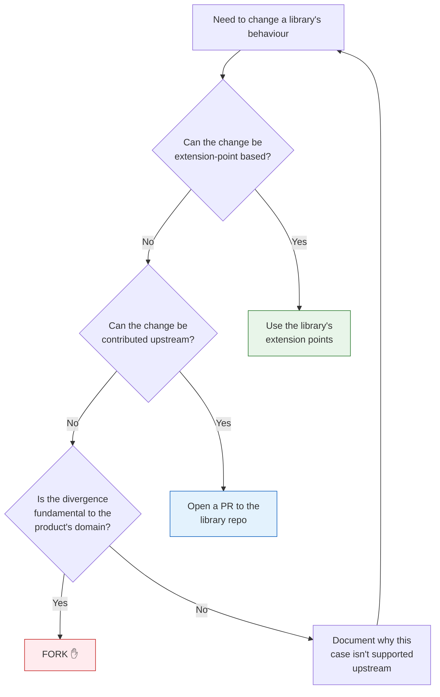

# Forking a library

**Forking is a last resort.** Before forking, exhaust the supported extension paths.

## Decision tree



## Rule of thumb

Fork when **all three** are true:

1. The change cannot be expressed via the library's documented extension points (no `IXxxProvider` or `IXxxHandler` interface fits).
2. The change cannot be contributed upstream — either it's product-specific (e.g. PetCare's pet-specific terminology that doesn't fit the generic `@chthonic/locale`), or the upstream maintainers explicitly declined.
3. The divergence is **fundamental to the product's domain**, not a workaround for a temporary upstream gap.

If only #1 holds, contribute upstream. If only #2 holds, file an issue. If only #3 holds, the library probably already exposes an extension point you've missed.

## Pre-fork checklist

Before opening a fork:

- [ ] Read the library's `extension-points.md` — confirm no listed hook fits.
- [ ] Read the library's recent CHANGELOG — confirm no incoming change addresses this.
- [ ] Open an issue in the library repo describing the use case. Tag it `divergence-considered`. Wait 7 days for upstream response.
- [ ] If upstream proposes a path forward, take it. If not, proceed.
- [ ] Open an RFC amendment in `chthonicsystems/architecture/rfcs/<NNNN>-...md` § Change History documenting the fork rationale.
- [ ] Get sign-off from platform-architecture (currently the founders).

## How to fork

1. **Fork the library repo on GitHub:**

   ```bash
   gh repo fork chthonicsystems/<lib> --clone --org <your-product-org>
   # or for an internal product fork:
   gh repo create <your-product-org>/<lib>-<product> --public --clone
   ```

2. **Rename the package** to avoid collision:

   - .NET: change `<PackageId>` in `Chthonic.<X>.csproj` → `Chthonic.<X>.<Product>` or `<Product>.<X>`. Example: `PetCare.Locale`.
   - npm: change `name` in `npm/package.json` → `@<product-org>/<lib>` or `@chthonicsystems/<lib>-<product>`. Example: `@petcare/locale`.

3. **Bump the major version to `1.0.0`** (or maintain pre-1.0 if the upstream is still pre-1.0). Make it clear this is a fork, not a continuation of the upstream version line.

4. **Document the divergence** in your fork's `README.md`:

   - Why you forked
   - Which upstream version you forked from (the SHA + tag)
   - What you changed
   - Whether you intend to continue tracking upstream changes

5. **Update your product's consumer config** to use the fork:

   ```xml
   <!-- Before -->
   <PackageReference Include="Chthonic.Locale" Version="0.1.0" />
   <!-- After -->
   <PackageReference Include="PetCare.Locale" Version="1.0.0" />
   ```

   Update `nuget.config` to add a feed pointing at the fork's GitHub Packages registry.

## Tracking upstream

Forks decay. To slow the decay:

- **Pull upstream changes monthly.** `git remote add upstream <upstream-url> && git fetch upstream main && git merge upstream/main`.
- **Resolve conflicts in the divergent code paths only.** If your fork only changes `CountryDefaults.cs`, every other file should merge clean.
- **Re-publish a new fork version after each upstream sync.**
- **If the divergence becomes too costly to maintain, propose contributing the change back upstream as an extension point.**

## Example — PetCare forks `@chthonic/locale` for pet-specific terminology

Hypothetical: PetCare needs species-specific date format defaults (puppy growth charts use a custom format that doesn't map to country defaults).

**Pre-fork attempts:**

1. ✅ Reviewed `@chthonicsystems/locale/libraries/locale/extension-points.md` — no `ISpeciesDefaultsProvider` exists.
2. ✅ Opened `chthonicsystems/locale/issues/42` — upstream declined adding species-specific defaults to a generic locale library.
3. ✅ Confirmed divergence is fundamental — pet-specific terminology IS PetCare's domain.

**Fork:**

```bash
gh repo create petcare-os/locale-petcare --public --clone
cd locale-petcare
# Modify CountryDefaults.cs to add SpeciesDefaults branch
# Bump PackageId to PetCare.Locale.Petcare
# Tag v1.0.0 + push
```

**PetCare consumer:**

```xml
<PackageReference Include="PetCare.Locale.Petcare" Version="1.0.0" />
```

## Anti-patterns

- ❌ **Forking because the upstream is "too generic".** Contribute generality back upstream instead.
- ❌ **Forking because of a single bug.** Fix in upstream + bump.
- ❌ **Forking and never re-syncing.** A static fork is a maintenance liability.
- ❌ **Forking and not announcing.** Other consumers need to know your fork exists if they ever consider the same divergence.

## Related

- [`platform/version-policy.md`](version-policy.md) — SemVer + breaking-change protocol; fork bumps to `1.0.0` to break SemVer parity with upstream.
- [`platform/library-consumption.md`](library-consumption.md) — registry config when a fork lives in a different package source.
- [RFC 0002 — Shared Library Strategy](https://github.com/chthonicsystems/architecture/blob/main/rfcs/0002-shared-library-strategy.md) — governing decision record (polyrepo + fork-rare-but-supported).
