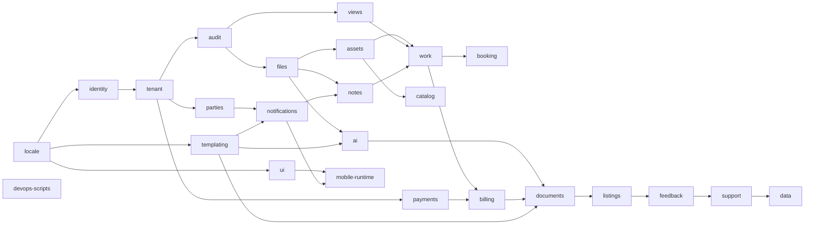

# Platform overview

The Chthonic platform is **25 shared libraries** (`@chthonic/*` and `@chthonicsystems/*`) extracted from [TorqueTech](https://github.com/chthonicsystems/torquetech) between 2026-04 and 2026-05. They power TorqueTech (the founding product) and the Phase-1 sister-products (MarineDeck — marina management; FlowLift — forklift fleet; PetCare OS — veterinary clinic).

A Phase-1 product imports the libraries it needs, registers a per-product entity subtype on the polymorphic `Asset` base, registers per-product Config Hub sections / document types / AI tool executors / listing themes, and overrides ~4 brand-token CSS custom properties for visual identity. Net-new code per Phase-1 product is **~15–40%**; the rest is shared.

## 25-library inventory

```
locale          identity        tenant          parties         payments
audit           files           assets          catalog         templating
notifications   views           notes           work            booking
billing         ai              documents       listings        feedback
support         data            ui              mobile-runtime  devops-scripts
```

Per-library deep-references live under [`libraries/<lib>/`](../libraries/). The full table with packages and versions is in [`AGENTS.md`](../AGENTS.md).

## Tier mental model

The 25 libraries naturally split into 8 tiers by responsibility. Tiers are not enforced at the package level (every library is a peer); they're a navigation aid.

| Tier | Libraries | Theme |
|---|---|---|
| 1 — Foundational | locale, identity, tenant, parties | No business domain. Every product depends on these. |
| 2 — Core domain | payments, audit, files, assets, catalog | "What does this tenant own and sell, and how do we trace changes?" |
| 3 — Cross-cutting | templating, views, notes | Polymorphic concerns that attach to any entity in any other library. |
| 4 — Communications | notifications | Multi-channel publisher consumed by every other domain library. |
| 5 — Work spine | work, booking, billing | Tenant-customer service flow: jobs, scheduling, money. |
| 6 — Feature | ai, documents, listings, feedback, support, data | Per-feature libraries that compose the spine. |
| 7 — UI | ui | Foundational design system (MD3 + app-* + 5 page patterns + brand tokens). |
| 8 — Mobile + DevOps | mobile-runtime, devops-scripts | Capacitor runtime + DevOps CLI. |

## Dependency DAG



Edges show **compile-time / declared dependencies**. The full dependency rules live in each library's `index.md` (front-matter `related-libs`).

## Critical non-edges (deliberate non-cycles)

A few apparent dependencies are intentionally **NOT** wired at compile time:

- **`tenant` does NOT depend on `files`.** Tenant logos and customer avatars are stored as URL-string fields (`System.LogoUrl`, `Customer.AvatarUrl`); the upload flow uses `files` at the application orchestration layer, not as a compile-time dependency. This avoids a near-cycle.
- **`work` does NOT depend on `billing`.** `Estimate` / `Invoice` reference `Job` by FK only; `Job.EstimateId`/`Job.InvoiceId` are simple FKs, not navigation properties. Billing depends on work; not the other way round.
- **`identity` does NOT depend on `tenant`.** Identity is the more foundational layer. Tenant scoping happens at the tenant layer's `IDataIsolationService`, which reads identity claims; identity itself stays unaware.

## Phase-1 product consumption matrix

| Library | TorqueTech | MarineDeck | FlowLift | PetCare OS |
|---|:---:|:---:|:---:|:---:|
| locale | ✅ | ✅ | ✅ | ✅ |
| identity | ✅ | ✅ | ✅ | ✅ |
| tenant | ✅ | ✅ | ✅ | ✅ |
| parties | ✅ | ✅ | ✅ | ✅ |
| payments + payments.stripe | ✅ | ✅ | ✅ | ✅ |
| audit | ✅ | ✅ | ✅ | ✅ |
| files | ✅ | ✅ | ✅ | ✅ |
| assets (registers `Vehicle`/`Vessel`/`Forklift`/`Pet`) | ✅ | ✅ | ✅ | ✅ |
| catalog | ✅ | ✅ | ✅ | ✅ |
| templating | ✅ | ✅ | ✅ | ✅ |
| notifications | ✅ | ✅ | ✅ | ✅ |
| views | ✅ | ✅ | ✅ | ✅ |
| notes | ✅ | ✅ | ✅ | ✅ |
| work | ✅ | ✅ | ✅ | ✅ |
| booking | ✅ | ✅ | ✅ | ✅ |
| billing + billing.xero / billing.quickbooks | ✅ | ✅ | ✅ | ✅ |
| ai | ✅ | ✅ | ✅ | ✅ |
| documents | ✅ | ✅ | ✅ | ✅ |
| listings | ✅ | ✅ | ✅ | ✅ |
| feedback | ✅ | ✅ | ✅ | ✅ |
| support | ✅ | ✅ | ✅ | ✅ |
| data | ✅ | ✅ | ✅ | ✅ |
| ui | ✅ | ✅ | ✅ | ✅ |
| mobile-runtime | ✅ | ✅ | ✅ | ✅ |
| devops-scripts | ✅ | ✅ | ✅ | ✅ |

Every Phase-1 product uses every shared library. Net-new product code is the per-product `Asset` subtype, per-product Config Hub sections, per-product AI tool executors, per-product Document Designer prompts, per-product listing themes, and brand-token overrides.

## What's NOT in this platform

- **Per-product entity subtypes.** `Vessel` lives in MarineDeck; `Forklift` lives in FlowLift; `Pet` lives in PetCare OS; `Vehicle` (the original) stays in TorqueTech. Each registers its subtype with `assets`'s `IAssetSubtypeRegistry` at startup.
- **Per-product UI surfaces.** Vehicle pages live in TT. Vessel pages live in MarineDeck. UI primitives (cards, buttons, modals) are shared via `ui`; bespoke product surfaces are per-product.
- **Per-product seed data.** Motorbike services seed in TT. Berth-cleaning services seed in MarineDeck. Each product owns its seed.
- **Per-product brand identity.** TT is yellow + black; MarineDeck is navy + teal; FlowLift is orange + grey. Brand colours live in CSS custom properties overridden by each product.

## Three repos you need to know about

| Repo | URL | Purpose |
|---|---|---|
| **architecture** | https://github.com/chthonicsystems/architecture | RFCs (decision records) — the WHY |
| **reference-docs** (this repo) | https://github.com/chthonicsystems/reference-docs | Per-library deep-references — the WHAT (current API surface) |
| **torquetech** | https://github.com/chthonicsystems/torquetech | Founding product — the reference consumer |

Plus 25 library repos under `chthonicsystems/<lib>` and 3 non-library template/workflow repos (`mobile-shell-template`, `devops-workflows`, `devops-template`).

## Related

- [`platform/library-consumption.md`](library-consumption.md) — how a product imports a library.
- [`platform/version-policy.md`](version-policy.md) — SemVer + breaking-change protocol.
- [`platform/extension-patterns.md`](extension-patterns.md) — the 6 reusable patterns across libraries.
- [`platform/forking-a-library.md`](forking-a-library.md) — last-resort divergence guidance.
- [`platform/new-library.md`](new-library.md) — adding a 26th library.
- [RFC 0001 — Platform Extraction](https://github.com/chthonicsystems/architecture/blob/main/rfcs/0001-platform-extraction.md) — governing decision record.
